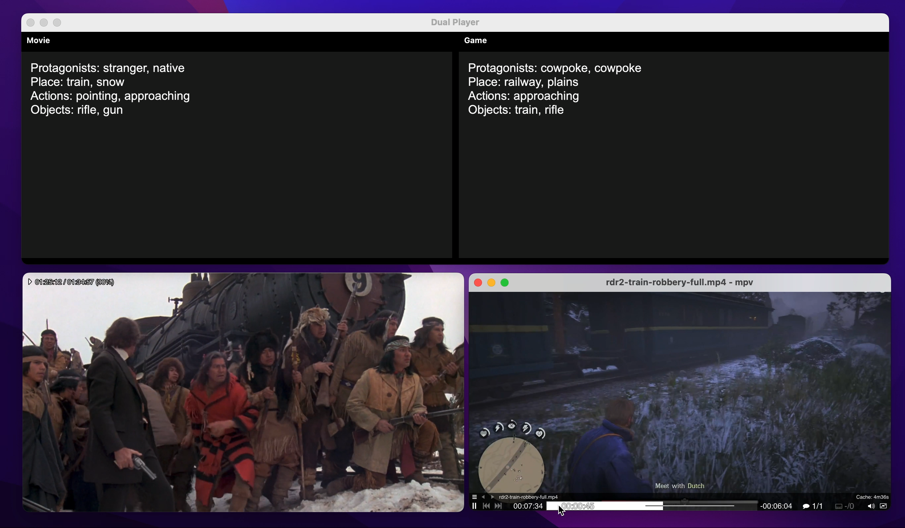

# Dual Player
This is the first working dual-player that uses real-time [FAISS](https://ai.meta.com/tools/faiss/) seeking to match up the closest semantic movie visual to the current gameplay.

Here is a video demo recording of this tool in action:

[](https://youtu.be/aycAulC_B_A)

[Playable-Cinema-FAISS-Test-2025-11-13](https://youtu.be/aycAulC_B_A) (YouTube unlisted video)

## Virtual Environment
```
$ pyenv activate playable-
```

## Conversion
There is a tool that converts individual captions inside of `shotlists/movie-name.csv` (JSON) → `shotlists/movie-name.txt` (single-line raw text) → `shotlists/movie-name.npy` (vectors).

## Text Embedding
- Text embedding model: BAAI/bge-small-en-v1.5 (Sentence-Transformers)
  - 384-dim sentence embeddings, optimized for retrieval
  - Used to encode captions from .txt into .npy vectors
  - https://huggingface.co/BAAI/bge-small-en-v1.5

## Vector Search Library
- FAISS (IndexFlatIP)
  - Exact inner-product search (cosine when embeddings are normalized)
  - Used to find the closest movie caption to the current gameplay caption
  - https://ai.meta.com/tools/faiss/
