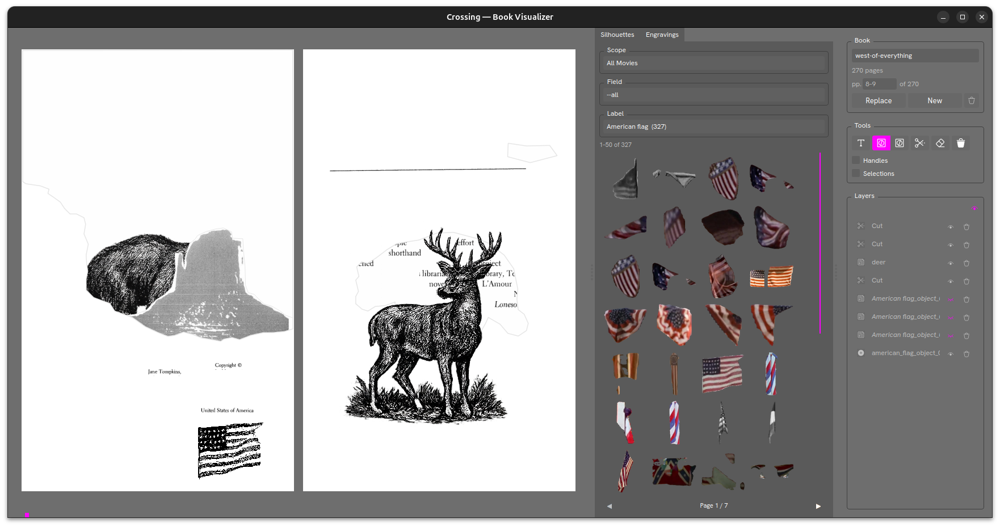

# Book



The `Book` visualizer is a page-spread composition tool. It lets you build artist books by placing silhouette cutouts and engravings onto book pages, browsing and dragging assets from the library panel on the right.

Open it with:

```
crossing visualizer book
```

## Layout

### Left — Page Spread

Displays a two-page spread at full width. Pages are shown book-style:

- Page 1 appears alone on the right (front cover)
- Pages 2–3, 4–5, etc. appear as left/right pairs
- The last page appears alone on the left (back cover) if the total page count is even

A fuchsia progress bar at the bottom of the spread area indicates the current position within the book.

### Middle — Asset Browser Panel

Two tabs for browsing assets to place on the page:

#### Silhouettes tab

Browse the silhouette catalog by **Scope** (All Movies or a specific film), **Field** (annotation field, e.g. `objects`, `animals`), and **Label** (specific vocabulary term with count shown). A paginated thumbnail grid shows all matching silhouette images. Scroll through pages with the `◀` `▶` arrows at the bottom.

#### Engravings tab

Browse imported engraving images using the same Scope / Field / Label selectors.

### Right — Book Panel

#### Book

Shows the current book name (e.g. `west-of-everything`) and total page count. The page indicator shows the current spread (e.g. `pp. 8–9 of 270`).

- **Replace** — replace the current book with another
- **New** — create a new empty book
- Trash icon — delete the current book

#### Tools

A toolbar for working with objects on the page:

| Icon | Tool |
|---|---|
| T | Text tool — add a text label |
| Silhouette icon | Place a silhouette object |
| Engraving icon | Place an engraving image |
| Scissors | Cut / trim a layer |
| Eraser | Erase parts of a layer |
| Trash | Delete the selected layer |

**Handles** / **Selections** — toggle transform handles and selection outlines for placed objects.

#### Layers

Lists all objects placed on the current spread in stacking order. Each layer has a name, visibility toggle, and delete button. Layers can include `Cut`, named objects (e.g. `deer`), and placed assets (e.g. `American_flag_object_1`).

## Navigation

| Key / Action | Description |
|---|---|
| `←` / `→` arrows | Previous / next spread |
| Click page bar | Jump to a spread |
| `Home` / `End` | Previous / next scope in the active browser tab |
| `PgUp` / `PgDn` | Previous / next field in the active browser tab |
| `↑` / `↓` | Previous / next label in the active browser tab |
| `Escape` / `Ctrl+Q` / `Ctrl+W` | Close |

## Requirements

Silhouette data must be built first using `crossing silhouette build`. Engraving images are imported via the engravings pipeline.
