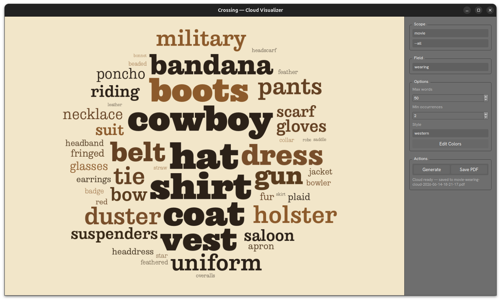

# Cloud



The `Cloud` visualizer is an interactive word-cloud explorer. It renders a frequency-weighted word cloud from annotation data and lets you adjust scope, field, and visual style in real time.

Open it with:

```
crossing generate cloud --visualizer
```

## Layout

### Left — Cloud Canvas

Displays the rendered word cloud. Word size is proportional to frequency in the selected annotation field. Colors are drawn from the active style.

### Right — Control Panel

#### Scope

| Control | Description |
|---|---|
| Media type | `<Media>` combines `movie` and `gameplay` annotations; `movie` or `gameplay` restricts to one type |
| Title | `--all` for the full corpus, or a specific film title |

Use `Home` / `End` to cycle through films without leaving the keyboard.

#### Field

The annotation field to count vocabulary from (e.g. `wearing`, `objects`, `action`, `animals`). Use `PgUp` / `PgDn` to cycle through fields.

#### Options

| Option | Description |
|---|---|
| Max words | Maximum number of words to include in the cloud |
| Min occurrences | Minimum times a word must appear to be included |
| Style | Color palette preset (e.g. `western`, `default`) |
| **Edit Colors** | Open the style color editor to customize background and palette colors |

#### Actions

- **Generate** — Re-render the cloud with the current settings
- **Save PDF** — Export the cloud as a PDF file to `output/clouds/`

The status line below the buttons shows the output filename after saving.

## Keyboard Shortcuts

| Key | Action |
|---|---|
| `Home` | Previous title in scope |
| `End` | Next title in scope |
| `PgUp` / `PgDn` | Previous / next annotation field |
| `Escape` / `Ctrl+Q` / `Ctrl+W` | Close |

## Requirements

Annotation data must exist in `data/annotations/`. Style presets are stored in `preferences/styles/` as JSON files.
