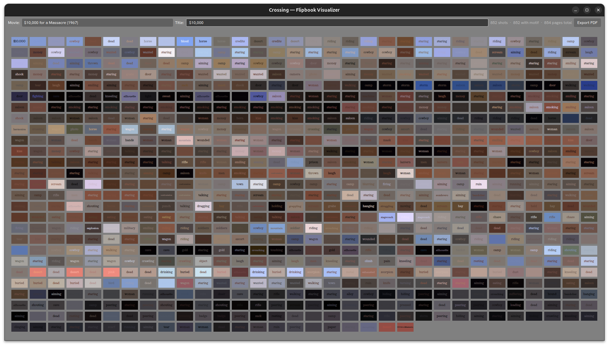

# Flipbook



The `Flipbook` visualizer displays a cinematic motif flipbook for a film — a compact grid where every shot is represented as a color swatch labeled with its assigned motif word.

Open it with:

```
crossing visualizer flipbook
crossing visualizer flipbook --media gameplay
```

## Layout

### Top Bar

- **Movie** dropdown — select the film to browse
- **Title** field — the motif title for the film (editable)
- Shot / motif / page count summary
- **Export PDF** button — save the current flipbook as a PDF

### Main — Page Grid

A scrollable grid of 16:9 page thumbnails, one per shot. Each thumbnail:

- Is filled with the shot's **palette background color**
- Shows the shot's **motif word** centered in the **palette foreground color**, typeset in Libre Clarendon

The grid reflowing automatically when the window is resized. Front and back cover pages are included as the first and last tiles.

Words shown in **bold** or high-contrast indicate strong motif assignments. Shots without a motif word appear as plain color blocks.

## Keyboard Shortcuts

| Key | Action |
|---|---|
| `Home` | Previous film |
| `End` | Next film |
| `Ctrl+P` | Export PDF for the current film |
| `Escape` / `Ctrl+Q` / `Ctrl+W` | Close |

## Requirements

Both motif data (`data/motifs/`) and palette data (`data/palettes/`) must be generated before the flipbook can be displayed. Run `crossing motif build` and `crossing palette build` first.
