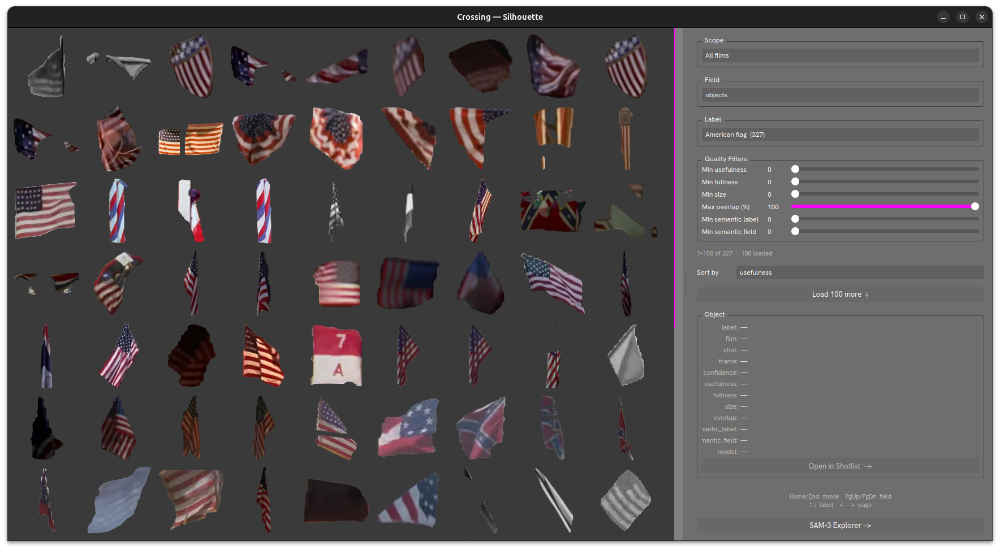

# Illustration



The `Illustration` visualizer browses extracted object silhouettes and generated engravings. It reads compact browse indexes so large catalogs open without scanning every metadata sidecar.

Open it with:

```
crossing visualizer illustration
```

## Layout

### Left — Thumbnail Grid

Displays a viewport-sized page of silhouettes or engravings. Page cells are populated incrementally so large catalogs do not block the window.

Click any thumbnail to select it and view its metadata in the Object panel.

### Right — Control Panel

#### Scope

Filter by **All films** or a specific film title.

#### Field

The annotation field the silhouettes were extracted from (e.g. `objects`, `animals`, `humans`).

#### Label

The vocabulary term to browse. The count of matching objects is shown in parentheses (e.g. `American flag (327)`).

#### Quality Filters

Sliders to refine which silhouettes are shown:

| Filter | Description |
|---|---|
| Min usefulness | Minimum usefulness score (CLIP confidence that the cutout matches the label) |
| Min fullness | Minimum coverage of the silhouette's bounding box |
| Min size | Minimum size of the object relative to the frame |
| Max overlap (%) | Maximum allowed overlap with other objects in the same shot |
| Min semantic label | Minimum semantic similarity to the label word |
| Min semantic field | Minimum semantic similarity within the annotation field |

#### Sort by

Sort the grid by `usefulness`, `size`, `fullness`, or other quality metrics.

#### Object (detail panel)

When a thumbnail is selected, shows its metadata:

- `label`, `film`, `shot`, `frame`
- `confidence`, `usefulness`, `fullness`, `size`, `overlap`
- `semantic_label`, `semantic_field`
- `model`

**Open in Shotlist →** — jump to the source shot in the Shotlist Visualizer.

## Navigation

| Key | Action |
|---|---|
| `↑` / `↓` | Previous / next label |
| `←` / `→` | Previous / next thumbnail in the grid |
| `Home` / `End` | Previous / next film |
| `PgUp` / `PgDn` | Previous / next annotation field |
| `Escape` / `Ctrl+Q` / `Ctrl+W` | Close |

## SAM-3 Explorer

The **SAM-3 Explorer →** button at the bottom-right opens an interactive shot inspection panel. Browse movies → scenes → shots, enter a concept word, and click **Run SAM-3** to see segmentation masks overlaid on the best frame for that shot.

## Browse Index

Use **Rebuild Index** in either source tab after catalog changes. The action rebuilds both source indexes for the selected media type. The equivalent CLI command is:

```bash
crossing index illustration --media movie
crossing index illustration --media both  # movie and gameplay
```

Missing or stale indexes are reported in the pagination area; the visualizer does not silently scan canonical catalog directories.

Indexes use SQLite with precomputed filter values so opening filter menus remains responsive while large catalogs load. Only the visible source loads at startup; the other source loads when its tab is first selected. Indexes created by older versions are marked stale and require one rebuild.
