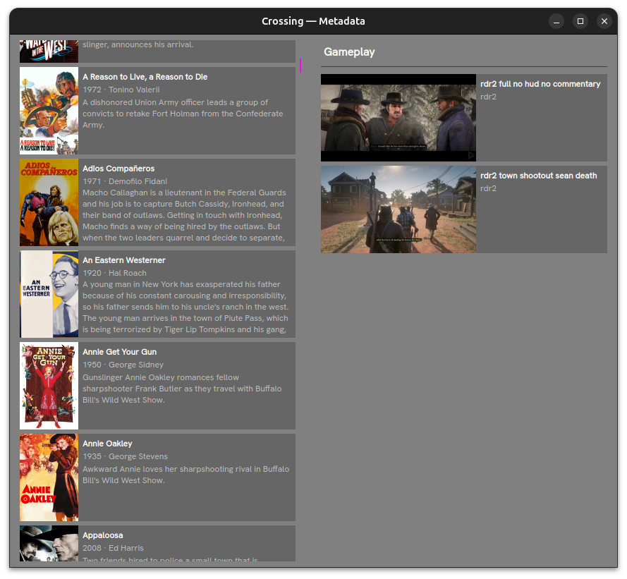

# Metadata



The `Metadata` visualizer is a scrollable card-based browser showing all imported media in two columns: **Movies** on the left and **Gameplay** on the right.

Open it with:

```
crossing visualizer metadata
```

## Layout

Each media entry appears as a card containing:

- **Thumbnail** — poster image for movies, or a video frame for gameplay clips
- **Title** — the media title (bold)
- **Year · Director** — for movies; game name for gameplay
- **Overview** — a short plot or description summary

Cards are loaded asynchronously; thumbnails appear as they become available.

## Navigation

Scroll independently within the Movies and Gameplay columns. The fuchsia scrollbar on the divider indicates loading progress.

## Requirements

Thumbnails are read from `media/thumbnails/<media_type>/`. Metadata is read from `data/metadata/`.
