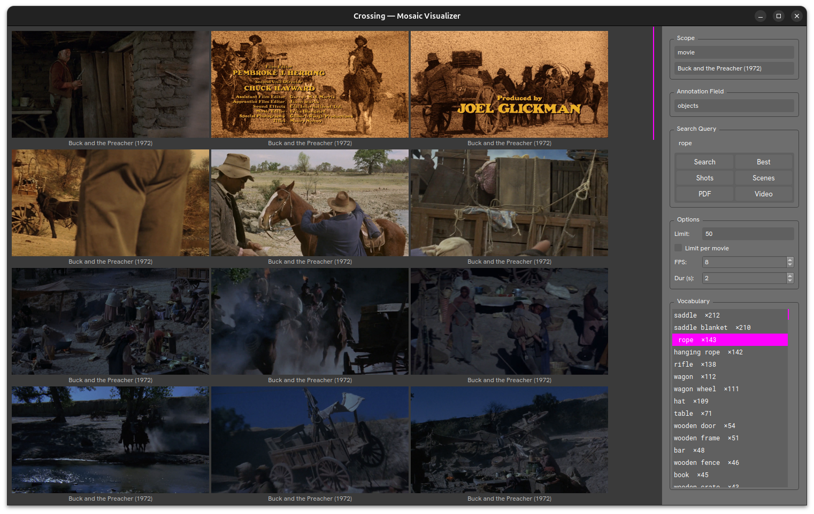

# Mosaic



The `Mosaic` visualizer is a live visual search browser. Enter a query and it displays a scrollable grid of matching shot frames extracted directly from the video files.

Open it with:

```
crossing visualizer mosaic
```

## Layout

### Left — Image Grid

A scrollable, zoomable mosaic of video frame thumbnails. Each tile is captioned with the film title and year. Tiles reflow automatically when the window is resized.

- **Zoom**: `Ctrl` + scroll wheel
- **Pan**: scroll wheel or scrollbars

### Right — Control Panel

#### Scope

Select the media type (`movie`, `gameplay`) and optionally restrict results to a single title. Use **--all** to search across the entire library.

#### Annotation Field

The annotation field to search against (e.g. `objects`, `wearing`, `action`, `humans`).

#### Search Query

Type a search term and click one of the search mode buttons:

| Button | Description |
|---|---|
| **Search** | Full-text search across the selected field |
| **Best** | Return only the single best-matching shot per film |
| **Shots** | Search at shot granularity (default) |
| **Scenes** | Group results by scene |
| **PDF** | Generate and save a mosaic PDF |
| **Video** | Export a video montage of matched shots |

#### Options

| Option | Description |
|---|---|
| Limit | Maximum number of results (default 50) |
| Limit per movie | Cap results to this many shots per film |
| FPS | Frame rate for video export |
| Dur (s) | Duration per shot in video export |

#### Vocabulary

A live list of the most frequent terms in the selected field for the current scope. Click any term to instantly run a search for it. The active term is highlighted in yellow.

## Keyboard Shortcuts

| Key | Action |
|---|---|
| `Home` | Previous title in scope |
| `End` | Next title in scope |
| `PgUp` / `PgDn` | Previous / next annotation field |
| `Escape` / `Ctrl+Q` / `Ctrl+W` | Close |

## Requirements

Video files must be present under `media/videos/<media_type>/`. Annotation data is read from `data/annotations/`.
