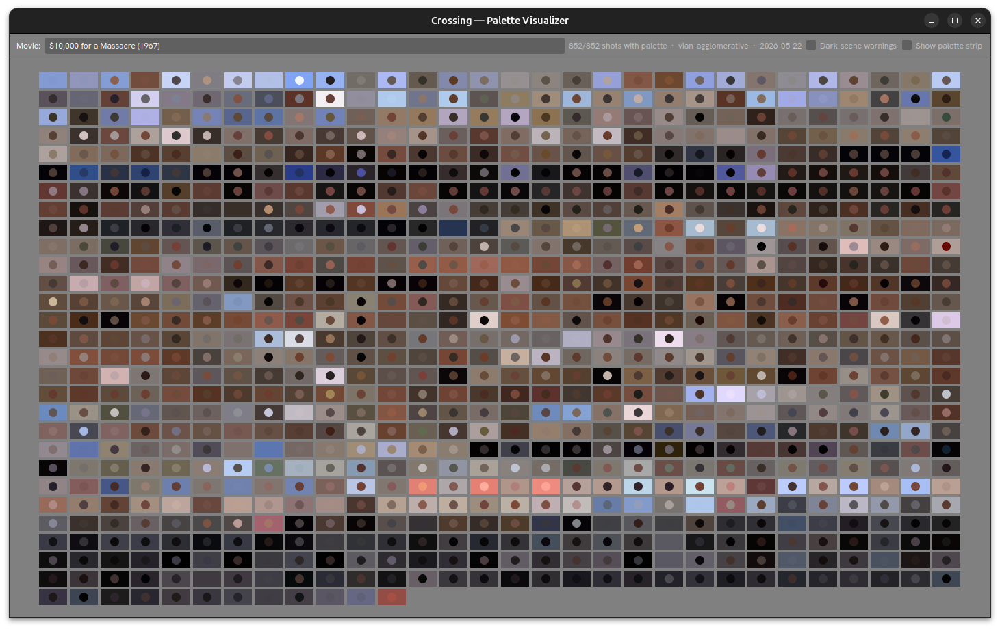

# Palette



The `Palette` visualizer displays the per-shot color palette for an entire film at a glance — a scrollable grid of color swatches showing the dominant foreground and background colors of every shot in sequence.

Open it with:

```
crossing visualizer palette
crossing visualizer palette --media gameplay
```

## Layout

### Top Bar

- **Movie** dropdown — select the film to browse
- Shot count and coverage summary (e.g. `852/852 shots with palette`)
- Clustering algorithm and date label
- **Dark-scene warnings** checkbox — highlight shots with very low luminance
- **Show palette strip** checkbox — toggle a color strip overlay

### Main — Palette Grid

A scrollable grid of 16:9 swatches, one per shot in chronological order. Each swatch:

- Is **filled** with the shot's dominant **background color**
- Has a **dot** in the center showing the dominant **foreground color**

This makes it easy to see the film's overall color progression at a glance — dark scenes cluster toward black backgrounds, warm scenes show earthy tones, outdoor daylight scenes show blue skies and sandy tones.

The grid reflowing automatically when the window is resized.

## Keyboard Shortcuts

| Key | Action |
|---|---|
| `Home` | Previous film |
| `End` | Next film |
| `Escape` / `Ctrl+Q` / `Ctrl+W` | Close |

## Requirements

Palette data must be built first with `crossing palette build`. Data is read from `data/palettes/`.
