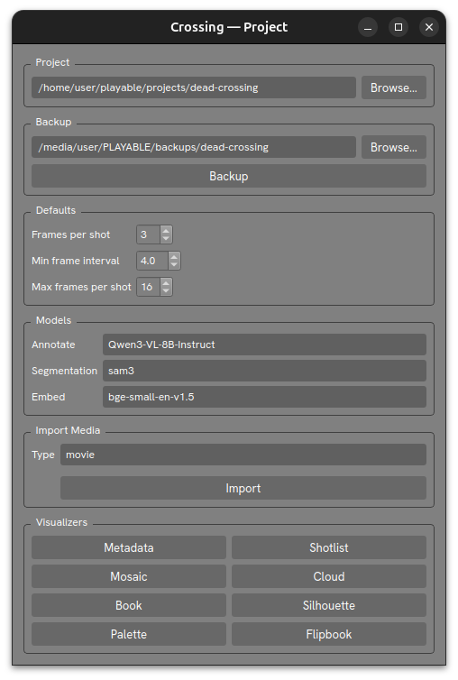

# Project



The `Project` visualizer is the main hub for Crossing Tool. It displays core project settings and provides launch buttons for every other visualizer.

Open it with:

```
crossing visualizer project
crossing visualizer          # default — opens Project
```

## Browser Statistics

The browser columns are, in order: **Movies**, **Gameplay**, **Shots**,
**Vocabulary**, **Silhouettes**, and **Engravings**.

Shots reads `data/indexes/corpus_stats.json`; its total covers movie and
gameplay annotations, and its distribution uses the annotation `type` field.
`<untyped>` counts canonical shot annotation records whose `type` value is
missing or empty. Vocabulary reads the canonical vocabulary indexes.

Silhouettes and Engravings read the current SQLite indexes under
`data/indexes/illustration/`; the Project visualizer never traverses either
source catalog. One silhouette is one indexed catalog object and contributes
to its single scalar `field`. One engraving is one indexed, generated
mode-specific record, so isolated and frame engravings from the same object are
counted separately. Each engraving has exactly one source silhouette, and its
authoritative category is the captured `silhouette.field` in engraving
provenance. Silhouettes with missing field provenance contribute to the
synthetic `<untyped>` category; engravings remain unavailable if their source
field provenance is missing.

After manually editing shot annotation JSON, rebuild this cache with:

```bash
crossing index stats --force
```

This is the simple Project-browser refresh command. The Project visualizer does
not traverse annotations or rebuild statistics itself. Close and reopen the
Project visualizer after the command if it is already open.

This command only rebuilds Project corpus statistics. If the edited annotation
text must also be reflected in semantic search, update that media type's search
index separately:

```bash
crossing index process --all --media movie
crossing index process --all --media gameplay
```

For vocabulary changes, use `crossing index vocabulary --all --force`.

After silhouette or engraving catalog changes, rebuild both media indexes:

```bash
crossing index illustration --media movie
crossing index illustration --media gameplay
```

Same-schema stale Illustration indexes keep displaying their last indexed field
values while the count row says `INDEX STALE`. Missing, malformed, or
older-schema indexes remain unavailable until rebuilt because their prior data
cannot be queried safely. A valid empty index displays a zero count and the
existing empty canvas.

## Sections

### Project

The path to your active project folder. Click **Browse…** to choose a different folder.

### Backup

Set a backup destination path and click **Backup** to copy the project data there.

### Defaults

Persistent defaults used by the `annotate` command:

| Setting | Description |
|---|---|
| Frames per shot | Number of frames sampled per shot for annotation |
| Min frame interval | Minimum seconds between sampled frames |
| Max frames per shot | Upper cap on frames sampled for any single shot |

### Models

The AI model names used for each pipeline stage:

| Field | Default | Description |
|---|---|---|
| Annotate | `gemma4-e4b` | Vision-language model for shot annotation |
| Segmentation | `sam3.pt` | SAM model for silhouette extraction |
| Embed | `bge-small-en-v1.5` | Embedding model for semantic search |

Click a field to type a model name, or choose a locally downloaded model from the dropdown.

### Import Media

Set the default **Type** (`movie` or `gameplay`) and click **Import** to run the import pipeline for new media files.

### Tools

The two Tools actions run through the canonical CLI and show a loading indicator
on the section header while they work:

| Button | Action |
|---|---|
| Thumbnail Palettes | Builds missing thumbnail palettes for movie and gameplay media, then refreshes the Project browser. |
| Rebuild Vocabulary | Rebuilds movie and gameplay vocabulary data with `crossing index vocabulary --all --force`, then refreshes the Project browser. |

Only one Tools action runs at a time. CLI failures are shown in the Project
visualizer without silently falling back to a GUI-side annotation traversal.

### Visualizers

Buttons to open each of the other visualizers:

| Button | Opens |
|---|---|
| Metadata | [Metadata Visualizer](visualizer-metadata.md) |
| Shotlist | [Shotlist Visualizer](visualizer-shotlist.md) |
| Mosaic | [Mosaic Visualizer](visualizer-mosaic.md) |
| Cloud | [Cloud Visualizer](visualizer-cloud.md) |
| Book | [Book Visualizer](visualizer-book.md) |
| Illustration | [Illustration Visualizer](visualizer-illustration.md) |
| Palette | [Palette Visualizer](visualizer-palette.md) |
| Flipbook | [Flipbook Visualizer](visualizer-flipbook.md) |
