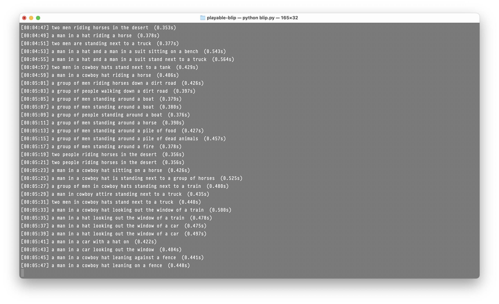
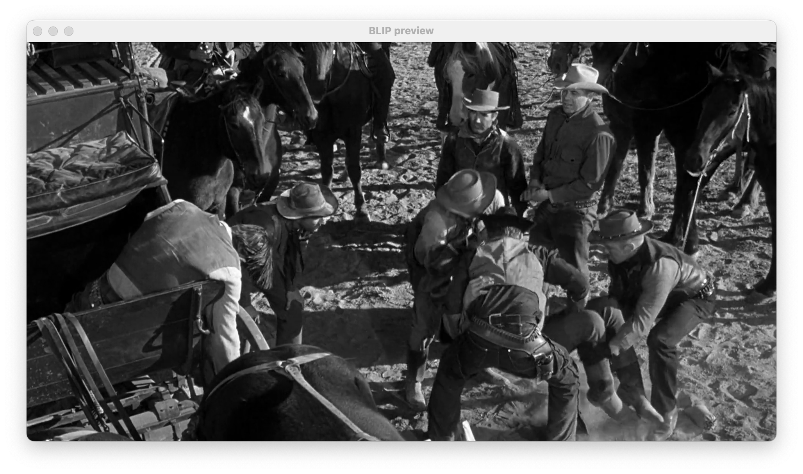

# BLIP
We're going to start a quick and dirty prototype to test the BLIP models and then start training our own model for live inferencing.

## Quick Start

### Installation

If you are on macOS, make sure you first have [Homebrew](http://brew.sh) installed and from homebrew, `pyenv` should be installed (`brew install pyenv` & `brew install pyenv-virtualenv`). On Windows, wedonno how all this works, sorry :-(

1. Create Python Environment
```
% cd ~/your-folder-path-to/playable-blip
pyenv install 3.11.9
pyenv virtualenv 3.11.9 playable-blip
pyenv activate playable-blip
```

2. Install requirements
```
% pip install --upgrade -r requirements.txt
```

## Results
I've created script to load a model from Huggingface (`model-downloader.py`) and another to test the downloaded blip model using a definable folder and movie file (`blip.py`).

Here is the file of the results: [result-2025-10-01-18-11-00.txt](./result-2025-10-01-18-11-00.txt)

And the timing scores on an M1-Macbook-Pro-Max-64GB:

```
--- Inference timing ---
Samples timed: 41
Avg latency per caption: 0.420s
```



