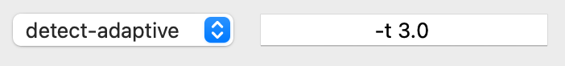

# Playable Cinema Multi-Tool

A comprehensive PyQt5-based application designed for video analysis, annotation, and scene detection. This tool combines previous work (`playable-captions-annotate-bot` & `playable-captions-playback`) into a unified multi-tool for *annotating* (a.k.a. BLIP *captioning*), *playback* (a.k.a. *inferencing*) captions, and various other uses such as identifying scene and movement changes.

## Features

- **Video Playback**: VLC-based video player with precise timeline control
- **Scene Detection**: Automated shot boundary detection using PySceneDetect
- **AI Annotation**: OpenAI GPT-4 Vision integration for automated scene description
- **Project Management**: Organized workspace with movies, metadata, subtitles, and annotations
- **Multi-window Interface**: Tabbed interface with specialized tools for different workflows

## Quick Start

### Installation

1. **Create Python Environment**
   ```bash
   cd ~/your-folder-path-to/playable-tool
   pyenv virtualenv 3.11.9 playable-tool
   pyenv activate playable-tool
   ```

2. **Install Dependencies**
   ```bash
   pip install -r requirements.txt
   ```

3. **Install External Tools** (macOS)
   ```bash
   brew install ffmpeg
   ```

### Running the Application

```bash
pyenv activate playable-tool
python app.py
```

## Project Structure
Click the `Folder` button in the `Cinemathèque` window to set your project folder. You can create this folder from the system window that opens, or select a previously created project folder.

### Auto-fix Folder Structure
When you select the project `Folder` button, it will automatically look inside that folder and verify any and all required sub-folders. It will suggest creating any missing folders. Click `Cancel` if you have somehow mistakenly chosen the wrong folder.

### Structure
The system should fix any missing folders for you, but if you are curious, each project requires the following folder structure:
```
project-folder/
├── movies/           # Video files (.mp4)
├── metadata/         # Movie metadata (metadata.csv)
├── posters/          # Movie poster images
├── shotlists/        # Scene detection results (.csv)
├── prompts/          # Movie-specific AI prompts (.txt)
├── subtitles/        # Subtitle files (.srt)
├── datasets/         # Training datasets
└── gameplay/         # Gameplay recordings
```

## Main Components

### 1. Cinemathèque Window
- Project and movie management
- Automatic metadata retrieval from TMDB (The Movie DataBase)
- Poster and subtitle downloading from TMDB and OpenSubtitles.com

### 2. Player Window
- Frame-accurate video playback
- Timeline scrubbing and seeking
- Keyboard shortcuts (Space: play/pause, Arrow keys: seek)

### 3. Shotlist Window
- Scene/shot detection and shot management
- Shot-by-shot captions (image descriptions) are stored here
- Configurable detection algorithms for scene detection
- Shot-by-shot timeline with start/end timecodes

### 4. Annotate Window
- OpenAI GPT-4o Vision integration for automatically captioning shots
    - Automated captioning can be edited
- Manual captioning of shots
- Configurable frame extraction count sent to OpenAI during automated captionning
- Bot mode for automated processing

### 5. Prompt Management
- Default system prompts
- Movie-specific prompt overrides
- Auto-saving text editors
- Optional tags can be embedded in prompts that will be populated with movie metadata.

#### Prompt tags
Use these tags inside your prompts and the app will replace each tag with its corresponding value.
- Movie Info
    - {title}
    - {year}
    - {director}
    - {description}
    - {tagline}
- Subtitle content
    - {shot-subtitles}
    - {full-subtitles}
- Images
    - {image-count}


## Scene Detection with PySceneDetect
This tool leans heavily on [PySceneDetect](https://www.scenedetect.com) for identification of scenes and shots.

### Classical Cinema Shotlist
Faust has done preliminary work testing the detectors on classical Hollywood westerns, for example [The Undefeated](https://www.themoviedb.org/movie/18972-the-undefeated), and suggests the default `tolerance` (`-t`) at `3.0` works fine for detecting classical single-camera shot-by-shot films.

### Detection Methods
There are various detection algorithms. Cf. [PySceneDetect Detectors Docs](https://www.scenedetect.com/docs/latest/cli.html#detectors). Each method has its own list of default and adjustable options. For example, `detect-adaptive` has a `-t` (`adaptive_threshold`) option that defaults to `3.0`, whereas `detect-content` has a `-t` (`threshold`) option that defaults to `27.0`. Enter any, all, or none of these options next to the `Detect` button.



#### [detect-adaptive](https://www.scenedetect.com/docs/latest/cli.html#detect-adaptive)
**Best for**: Variable content with mixed shot types

Options:
- `adaptive_threshold` (`-t`, `--adaptive_threshold`)
    - The threshold for triggering a cut (float, default: 3.0)
- `min_content_val` (`-c`, `--min-content-val`)
    - Minimum content value to trigger a cut (float)
- `frame_window` (`-f`, `--frame-window`)
    - Size of the rolling window (int)
- `weights` (`-w`, `--weights`)
    - Tuple of 4 floats: (delta_hue, delta_sat, delta_lum, delta_edges)
- `luma_only` (`-l`, `--luma-only`)
    - Boolean flag to use only luma channel
- `kernel_size` (`-k`, `--kernel-size`)
    - Size of kernel for edge detection (int)
- `min_scene_len` (`-m`, `--min-scene-len`)
    - Minimum scene length (int, float, or timecode string)

**Examples:**
- `-t 2.5` (sets adaptive_threshold)
- `-c 16.0` (sets min_content_val)
- `-f 4` (sets frame_window)
- `-w 1.0 1.0 1.0 0.0` (sets weights)
- `-l` (sets luma_only to True)
- `-k 5` (sets kernel_size)
- `-m 100` (sets min_scene_len to 100 frames)
- `-m 3.5s` (sets min_scene_len to 3.5 seconds)
- `-m 00:01:52.778` (sets min_scene_len to a timecode)

**Note:** The bigger the `-t ##` number, the fewer shots you will have. In a 10:00 video, we tried `-t 50` and there were only 4 shots. A low number, sometimes even `-t 2.0` can have a very high number of shots, especially if there is a lot of camera movement, such as in video games.

#### [detect-content](https://www.scenedetect.com/docs/latest/cli.html#detect-content)
**Best for**: General content-based detection

Options:
- `threshold` (`-t`, `--threshold`) - Content change threshold (default: 27.0)
- `weights` (`-w`, `--weights`) - RGB channel weights
- `luma_only` (`-l`, `--luma-only`) - Use only luma channel
- `kernel_size` (`-k`, `--kernel-size`) - Edge detection kernel size
- `min_scene_len` (`-m`, `--min-scene-len`) - Minimum scene length
- `frame_window` (`-f`, `--frame-window`) - Analysis window size

#### [detect-hash](https://www.scenedetect.com/docs/latest/cli.html#detect-hash)
**Status**: Not yet implemented

#### [detect-hist](https://www.scenedetect.com/docs/latest/cli.html#detect-hist)
**Best for**: Color-based scene changes

Options:
- `threshold` (`-t`, `--threshold`) - Histogram difference threshold
- `bins` (`-b`, `--bins`) - Number of histogram bins
- `min_scene_len` (`-m`, `--min-scene-len`) - Minimum scene length

#### [detect-threshold](https://www.scenedetect.com/docs/latest/cli.html#detect-threshold)
**Best for**: Simple brightness-based detection

Options:
- `threshold` (`-t`, `--threshold`) - Brightness change threshold
- `fade_bias` (`--fade-bias`) - Fade detection bias
- `add_last_scene` (`--add-last-scene`) - Include final scene
- `min_scene_len` (`-m`, `--min-scene-len`) - Minimum scene length

## AI Integration

### OpenAI Configuration
1. In your Project Folder, find `preferences/api_key.txt` and replace contents with your own OpenAI API key
2. Configure prompts in Default or Shot Prompt tabs
3. Adjust frame count for API calls (default: 5 frames per shot)

### Bot Mode
The Annotate window includes an automated "Bot" mode that:
1. Calls OpenAI API for current shot
2. Automatically submits the generated caption
3. Moves to the next shot
4. Repeats until all shots are processed

## Keyboard Shortcuts

### Global Shortcuts
- **Space**: Play/Pause video
- **L** or **V**: Load video file
- **Left/Right Arrow**: Seek (hold Shift for fast seek)

### Annotate Window
- **A**: Submit current caption to shotlist
- **O**: Send current shot to OpenAI API
- **B**: Toggle bot mode (automated processing)
- **N**: Jump to next shot

## Configuration

### API Keys Required
Once you have created a `Project` folder, you need to copy the following API keys into their respective text files inside the project folder's `Preferences` folder. Just copy-paste the respective API key on the first line of each text file and save:
- `openai_api_key.txt` - [OpenAI API key](https://platform.openai.com/api-keys)
- `tmdb_api_key.txt` - [TMDB API key](https://developer.themoviedb.org/docs/getting-started) (for metadata)
- `opensubtitles_api_key.txt` - [OpenSubtitles API key](https://forum.opensubtitles.com/)

## File Formats

### Supported Video Formats
- MP4

## Troubleshooting

### Common Issues

**FFmpeg Not Available**
```bash
# macOS
brew install ffmpeg
# Linux
sudo apt install ffmpeg
```

**API Errors**
- Verify API keys in `preferences/` folder
- Check internet connection
- Ensure proper file permissions

### Debug Mode
Set `DEBUG = False` in source files for verbose logging:
- `shotlist.py` line 3
- `annotate.py` line 5

## System Requirements

- **Python**: 3.11.9+ (recommended with pyenv)
- **Operating System**: macOS, Linux, Windows
- **External Tools**: FFmpeg or VLC
- **Memory**: 4GB+ RAM recommended for video processing
- **Storage**: Varies by project size

## Development

### Architecture
- **PyQt5**: GUI framework
- **Signal/Slot**: Inter-window communication
- **Threading**: Non-blocking API calls and video processing
- **CSV**: Data persistence
- **JSON**: Preferences storage

### Key Classes
- `ShotlistWindow`: Scene detection and management
- `PlayerWindow`: Video playback control  
- `AnnotateWindow`: AI annotation interface
- `CinemaWindow`: Project management

## License

[Add your license information here]

## Contributing

[Add contribution guidelines here]

## Acknowledgments

- [PySceneDetect](https://www.scenedetect.com) for scene detection algorithms
- [OpenAI](https://openai.com) for GPT-4 Vision API
- [TMDB](https://www.themoviedb.org) for movie metadata
- [OpenSubtitles](https://www.opensubtitles.org) for subtitle data