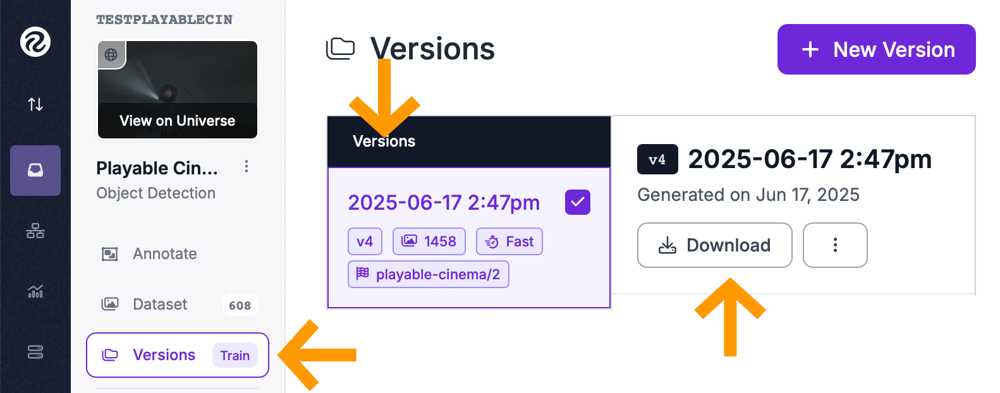

# Trainer
## Playable Cinema

This is our training code used for local training on Apple Silicon Macs, as well as information on training remotely on Google Colab.

## Dataset
Our datasets are being labelled by [Faust Perillaud](.) over at Roboflow. For now, we are only exploring labelled datasets on the game [Inside](https://www.playdead.com/games/inside/) by [Playdead](https://www.playdead.com).

[Roboflow Playable Cinema](https://app.roboflow.com/testplayablecin/playable-cinema/overview)

# Local Training

## Download
Download the dataset from Roboflow :

```
> cd ./code/playable-trainer
```



```
> unzip name-of-dataset.v4i.yolov5pytorch.zip -d playable-cinema-dataset
```

Big dump of `.jpg` don't be frightened; this creates a folder called `playable-cinema-dataset/`.

```
playable-cinema-dataset/
├── data.yaml
├── train/
│   ├── images/
│   └── labels/
├── valid/
│   ├── images/
│   └── labels/
├── test/
│   ├── images/
│   └── labels/

```

## Run
```
> cd ./code/playable-trainer
> python train.py
```

## YOLO
It looks like `yolov8n.pt` is the yolo training thingy that makes Yolo work because it downloads it directly from their github. Not sure what this is about, need to clarify how to choose the training model, the data format, etc.

## Pyenv
```
> cd ./code/playable-trainer
> pyenv virtualenv 3.11.9 playable-trainer
```

To activate :

```
> pyenv activate playable-trainer
```

## Dependencies
To train we need to install the [Ultralytics](https://github.com/ultralytics/ultralytics) libraries.
```
> pip install ultralytics
```

# Colab Training
There is a `head-irad-playable-dataset-trainer.ipynb` script on Douglas' Google Colab.

## A-100
We've had fast results with connecting to `A-100` (NVIDIA) cards.

## Upload
For example, we uploaded this .zip file to Colab: `Playable Cinema.v4i.yolov5pytorch.zip` and it did it's thing putting the contents into the Google Colab local folder. Note there is a %### done progress bar.

This is ugly, but I renamed this zip to `playable-trainer.zip` for the Colab script.

There is a new big `.zip` dump.

## Install
Install `ultralytics`

## Train
Last train took `?min`

## Rename old model
In `playable-playback` folder, rename `model.pt` > `model-2025-##-##.pt` so that we can go back to older trainings.

## Download
Download into `playable-playback` folder and rename to `model.pt`.
