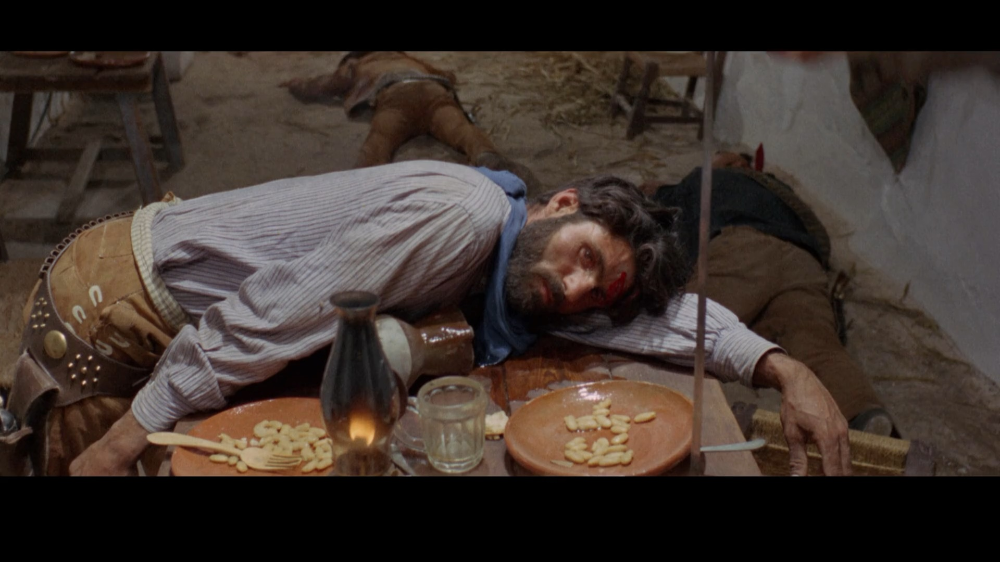
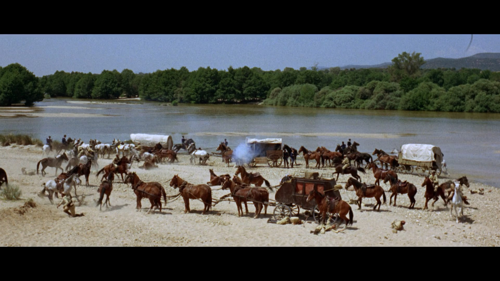
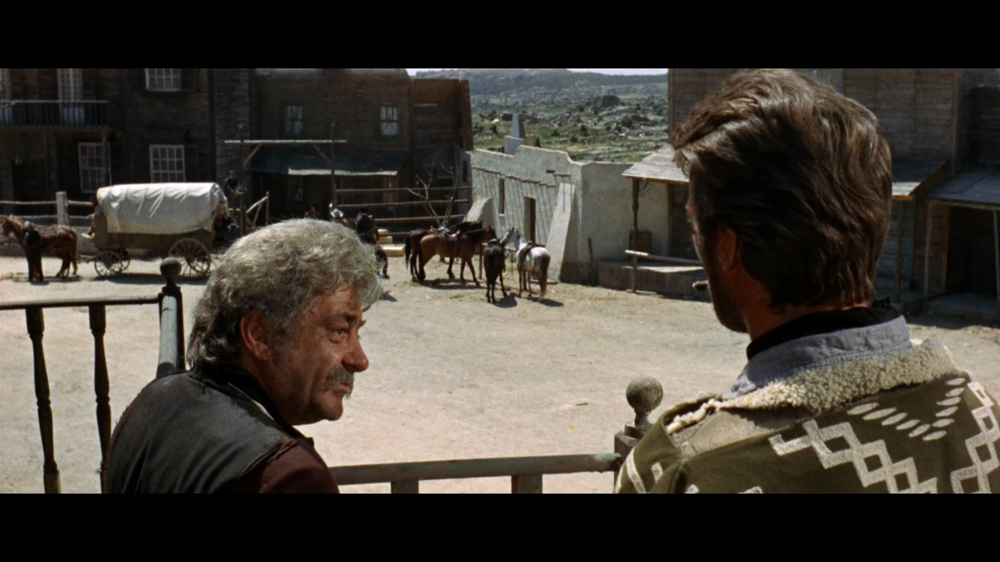

# Playable Local
We are going to explore local inferencing. We'll start by using [Ollama](https://ollama.com/) which allows us to easily run various open source models on an Apple Silicon Mac.

## Installation
Here were the basic installation steps we used for testing, mostly using Ollama for its easy installation.

1. Create an account on [Ollama](https://ollama.com/) and [Download Ollama](https://ollama.com/download) for your platform.
2. `Ollama` > `Settings` > Connect account
3. Note: Ollama will run in background. Cf. `System Settings` > `General` > `Ollama`
4. Install Model. For example, to load `llama 3.2 Vision`: `$ ollama pull llama3.2-vision`
5. Open Ollama via app where you can easily do drag/drop image tests, or from the command line: `$ ollama run llama3.2-vision` and then create a python or web app to test the inferencing.

## GPT-OSS
The fist thing we tried was OpenAI's [GPT-OSS](https://openai.com/index/introducing-gpt-oss/) model. The idea was that, since we were already using the [Open AI API](https://platform.openai.com/) for testing our annotation system, OpenAI OSS could (hopefully) give us silmilar quality annotations, only locally — allowing us to avoid all the image-upload costs which could quickly become significant if we did all the films’ annotations via their web API.

Immediate snag: GPT-OSS is a language-only model.

## Llama 3.2 Vision
So we moved to [Llama 3.2 Vision](https://ai.meta.com/blog/llama-3-2-connect-2024-vision-edge-mobile-devices/) which we downloaded via [Ollama]() cf. below. It can also be found on [Huggingface](https://huggingface.co) at [Llama-3.2-11B-Vision](https://huggingface.co/meta-llama/Llama-3.2-11B-Vision).

### Test No.1
Here was our first speed test on the following images. To make sure we are only doing local inferencing without any web search, etc, we have activated `Airplane Mode`. No idea if this actually changes anything.

Of note: the movie is [A Fistfull of Dollars](https://en.wikipedia.org/wiki/A_Fistful_of_Dollars), Sergio Leone, 1964.

> Can you annotate this image? It is from a western movie.

> Here is a concise description of the image:

> The image is a still from the 1966 western movie "The Good, the Bad and the Ugly" directed by Sergio Leone. The scene depicts a man lying on a table, surrounded by food and drinks, with a bandage on his head and a gun in his hand. He is wearing a white shirt and brown pants, and his face is covered in blood.
> The image captures a dramatic moment from the film, showcasing the character's resilience and determination in the face of adversity. The scene is set in a rugged, Western-style environment, with a table and chairs in the background, adding to the sense of tension and drama.

- - - - 
> Can you annotate this screenshot from a western?

> The image appears to be a still from the 1965 Western film "The Good, the Bad and the Ugly," directed by the legendary Italian director, Sergio Leone. The scene shows a group of horsemen and horse-drawn wagons on a sandy bank, with a river in the background. The scene is likely set in the American West during the Civil War era. The wagon train is likely on its way to the west, and the horsemen are likely a group of travelers or explorers. The scene is likely meant to convey a sense of adventure and exploration, as the characters are on a journey to discover new lands and opportunities. The image is likely meant to be a dramatic and heroic moment in the film, as it suggests that the characters are on a grand adventure.

- - -

> Can you annotate this screenshot from this western movie?

> The image appears to be a still from the 1973 western film "The Outlaw Josey Wales" directed by.

> The image shows two men standing on a balcony looking out over a town square. The man on the left is older and has a mustache and gray hair. The man on the right is younger and has brown hair. They are both wearing western-style clothing. In the background, there are several buildings, including a general store and a saloon. There are also several horses and horse-drawn carriages in the background. The overall atmosphere of the image suggests a sense of tension or conflict, as the two men seem to be engaged in a conversation or argument. The setting of the town square and the western-style clothing worn by the men suggests that the scene is set in the 19th century American West.

#### Test No.2
Not sure if this test is conclusive — not sure if this model can even do web-search — but we tried removing airplane mode and got this:

> Can you annotate this image? It is from a western movie.

> This scene is from the 1965 Western film "A Fistful of Dollars," also known as "The Good, the Bad, and the Ugly," directed by the legendary Italian filmmaker Sergio Leone. The scene features the character of "The Man with No Name" played by the iconic actor and director, "Django" and "A Fistful of Dollars" star,  "Spaghetti Western" icon, and one of the most popular and influential figures in the history of cinema,  "Ennio"  "Enrico"  "Enzo"  "Enzo"  "Enzo"  "Enzo"  "Enzo"  "Enzo"  "Enzo"  "Enzo"  "Enzo"  "Enzo"  "En"  "En"  "En"  "En"  "En"  "En"  "En"  "En"  "En"  "En"  "En"  "En"  "En"  "En"  "En"  "En"  "En"  "En"  "En"  "En"  "En"  "En"  "En"  "En"  "En"  "En"  "En"  "En"  "En"  "En"  "En"  "En"  "En"  "En"  "En"  "En"  "En"  "En"  "En"  "En"  "En"  "En"  "En"  "En"  "En"  "En"  "En"  "En"  "En"  "En"  "En"  "En"  "En"  "En"  "En"  "En"  "En"  "En"  "En"  "En"  "En"  "En"  "En"  "En"  "En"  "En"  "En"  "En"  "En"  "En"  "En"  "En"  "En"  "En"  "En"  "En"  "En"  "En"  "En"  "En"  "En"  "En"  "En"  "En"  "En"  "En"  "En"  "En"  "En"  "En"  "En"  "En"  "En"  "En"  "En"  "En"  "En"  "En"  "En"  "En"  "En"  "En"  "En"  "En"  "En"  "En"  "En"  "En"  "En"  "En"  "En"  "En"  "En"  "En"  "En"  "En"  "En"  "En"  "En"  "En"  "En"  "En"  "En"  "En"  "En"  "En"  "En"  "En"  "En"  "En"  "En"  "En"  "En"  "En"  "En"  "En"  "En"  "En"  "En"  "En"

- - - - 
> Can you annotate this screenshot from a western?

> This is a scene from the 1965 Western film "The Good, the Bad and the Ugly" directed by Sergio Leone. The scene shows a group of horse-drawn wagons and riders on a beach, with a river in the background.

> The wagons are covered with white canvas and have a classic Western design, with a central wheel and a team of horses or mules attached to them.
> The riders are dressed in Western-style clothing, with some wearing cowboy hats and others wearing bandannas or scarves.
> The horses and mules are of various breeds, including horses with a strong build and mules with a more rugged appearance.
> The riders are engaged in various activities, such as grooming their horses, preparing to ride, or simply standing around and talking.
> In the background, there is a river with a calm surface, and a line of trees or bushes along the riverbank.
> The sky is clear and blue, with no clouds in sight.
> Overall, the scene suggests that the characters are preparing to travel or are already on the move, possibly on a long journey across the Western United States. The presence of the river and the trees in the background adds to the sense of vastness and openness of the Western landscape.

- - -

> Can you annotate this screenshot from this western movie?

> The image appears to be a still from the 1966 western film "The Good, the Bad and the Ugly" directed by Sergio Leone. The scene is set in a dusty, sun-scorched town square, with two men standing on a balcony, looking out over the scene below. One man, dressed in a brown poncho with a white geometric pattern, is turned away from the camera, while the other, wearing a black leather jacket, is facing him. The atmosphere is tense and foreboding, with a sense of impending violence or confrontation. The background is filled with the sounds of horse hooves and the murmur of townspeople, adding to the sense of unease. The overall mood is one of high tension and anticipation, as if something is about to happen.

## Llama 4 Scout
We also installed [Llama 4.0 Scout](https://huggingface.co/meta-llama/Llama-4-Scout-17B-16E) (cf. [Ollama Scout instructions](https://ollama.com/library/llama4:scout)). Unfortunately, with Douglas' M1 64GB Max processor just a single query was still inferencing after 30 minutes. Three attemps later, we gave up.

## Gemma3 4B
We also tried Google's [Gemma3 4B](https://huggingface.co/google/gemma-3-4b-it) model, again via Ollama: `$ ollama pull gemma3:4b`. The first results were the most impressive.

### Test No.1
> Annotate this image from the western “A Fistfull of Dollars”, Sergio Leone, 1964.

> Okay, let’s break down this iconic scene from Sergio Leone's A Fistful of Dollars. Here’s an annotation of the image:

> Overall Impression:

> This is arguably one of the most recognizable and visually striking scenes in the entire film. It’s a key moment of tension and confrontation, setting the stage for the story’s central conflict. The sheer scale of the image and the staging contribute immensely to Leone’s signature style.

> Specific Elements & Observations:

> The Wagon Train: The central focus is the wagon train, packed with horses and a large canvas-covered wagon. It’s a massive, meticulously constructed set. The wagon is covered with what looks like supplies – likely food and equipment. The wagon’s design and the way the horses are tied to it suggests a sense of urgency and, potentially, chaos.

> The Riders: The image is filled with numerous riders. They are a mix of men and what appear to be younger people. Their clothing reflects the era - dusty, worn leather, and simple garments. They are positioned in a seemingly disorganized manner, which is consistent with the film's portrayal of a rough-and-tumble outlaw band.

> Smoke: Notice the significant plumes of smoke rising from the right side of the frame. This is a crucial detail, clearly indicating a recent gunfight or explosion, and dramatically heightening the sense of danger and immediate aftermath.

> The River: The wide, muddy river in the background is a significant element. It represents a physical barrier, a potential escape route, and a visual reminder of the vastness and difficulty of the American West.

> Setting & Lighting: The scene is filmed in a sunny, daytime setting. This contrasts with the dark and gritty atmosphere of the film. The high-key lighting – bright, even illumination – is characteristic of Leone's cinematic style.

> Composition: Leone’s masterful use of composition is evident here. The wagon train stretches across the frame, creating a sense of depth and scale. The figures are arranged in a deliberately chaotic way, further enhancing the feeling of disorder and tension.

> Significance within the Film:

> This scene establishes the major players - the bandits (led by Harmonica) - and their involvement in a dispute over a treasure. The arrival of the wagon train marks the beginning of the escalating conflict, and the smoke indicates the immediate consequences of a previous gunfight.

> Do you want me to delve into a specific aspect of the image in more detail, like the symbolism or Leone's directorial choices?

### Test No.2
Gave similar results from above.

## 