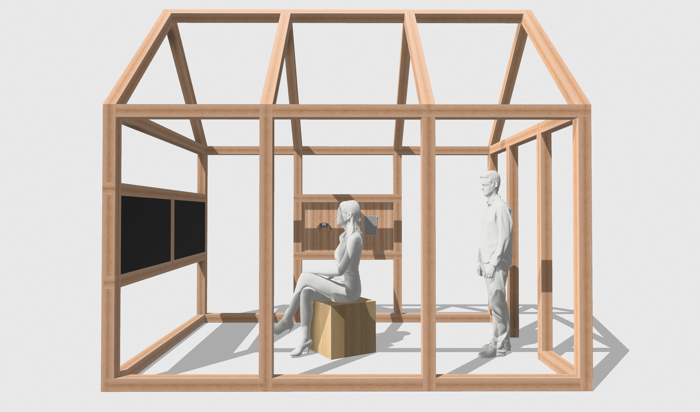
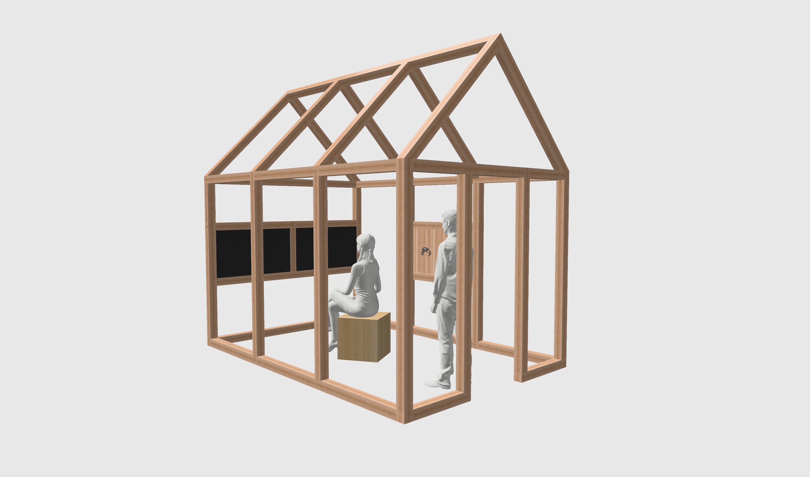

# Cowpoke Cabin
The cowpoke cabin is the physical manifestation of the Playable Cinema project, and regroups all the various components into a single installation.

## Blueprints
Blueprints to build the cabin can be found in this folder at: [cowpoke-cabin](./blueprints/)

## STEP File
You can download the latest 3D model of the cabin in two formats:
- [head-irad-cowpoke-cabin-2025-09-29.shapr](./models/head-irad-cowpoke-cabin-2025-09-29.shapr) 
- [head-irad-cowpoke-cabin-2025-09-29.step](./models/head-irad-cowpoke-cabin-2025-09-29.step)

Note: The original Shapr3D file contains modular parametric varibles that can adjust various aspects of the design.

## Brief
- Structure. Wood-framed structure (wood source TBD).
- Joints. A color-coded (metal? wood? ABS?) joint system allowing for this structure to be assembled-dissassembled for various exhibitions of the project. This color-coding system should be visible to the public visiting the installation
- Troughs. Cable-troughs are cut into the beams of the structure to allow the 230V power to the Cowpoke Console, the screens, the HDMI image cables leading to the integrated Stand, and the USB cable connecting the Cowpoke Controller to the console. The cables and the troughs should be visible to the public standing outside of the structure. The artifice of the electronics should be visible, similar to how the “backstage” of a theatre, with all of  its cables, wires, and pulleys has its own sort of aesthetic charm. These cable troughs are not as prominent while sitting inside of the Structure.
- Chair. A simplified (low-poly?) windsor-style chair, evoking the simple shapes of the 19th century U.S. western cowpoke history — while simplifying its core shapes. The chair is not attached to the structure, so visitors can move it around inside of the structure as they please.
- Stand. Attached structurally to the cabin structure is a Stand that holds a screen, showing real-time information on the A.I. system as it interprets the gameplay footage. This Stand will also hold the Cowpoke Controller.
- Screens (x2). Two basic 16:9 television-style screens/monitors/whatevers are placed inside of the “window” sections of the structure. They have naked open-back electronics on their back-side, and the two screens point inwards to the visitor/player sitting inside the Structure.
- A Color-Coding System identifies the connections between the joints, structure, wires, and electronic components of the cabin, controller and console. These joints should be visible to visitors of the installation, and are a part of the playful western-in-a-kit concept of the overall design philosophy.

## Renders

## Dimensions
Les dimensions risquent d'être encore modifiés ces prochains jours.
