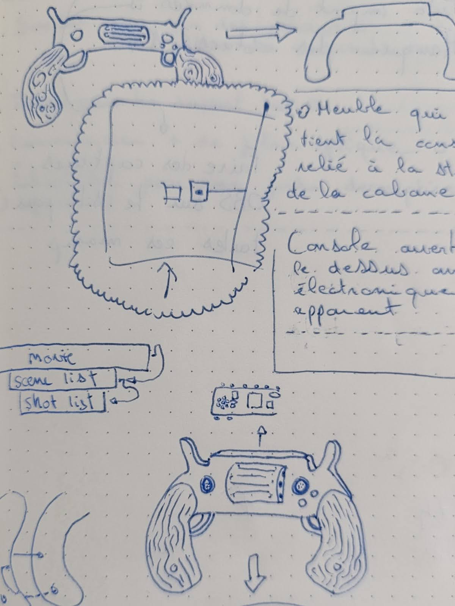
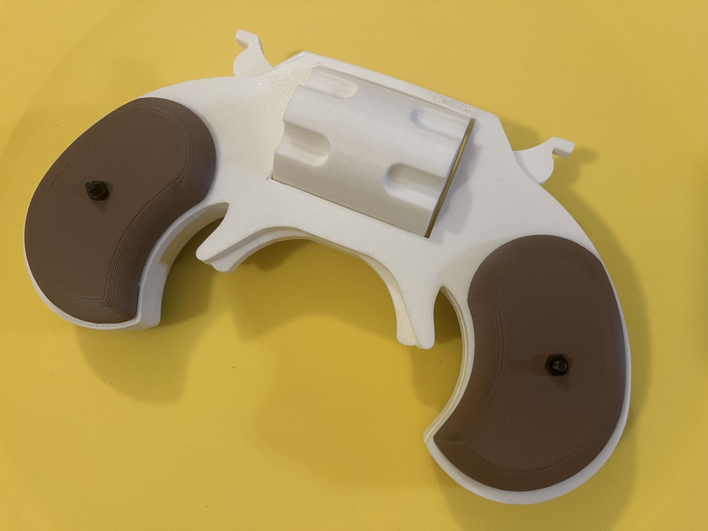
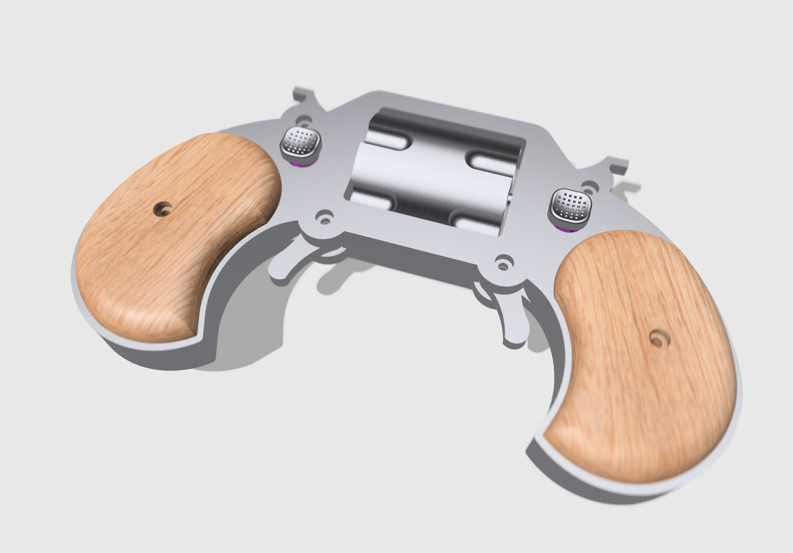
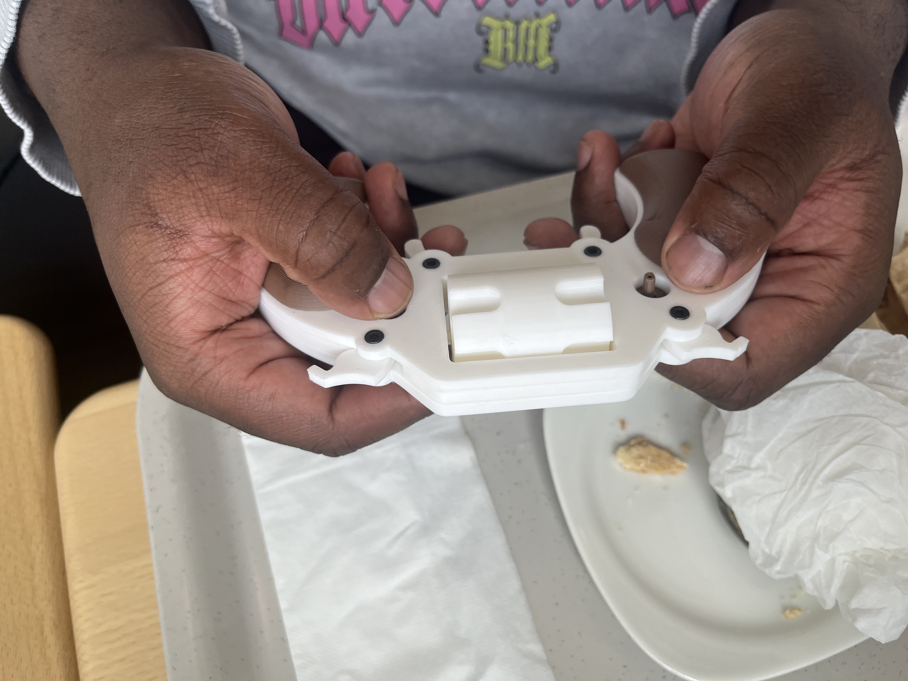
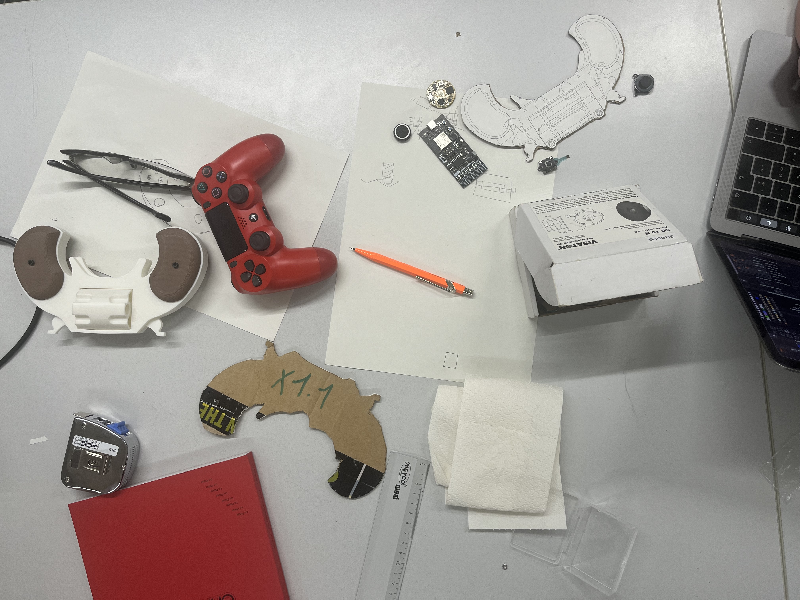
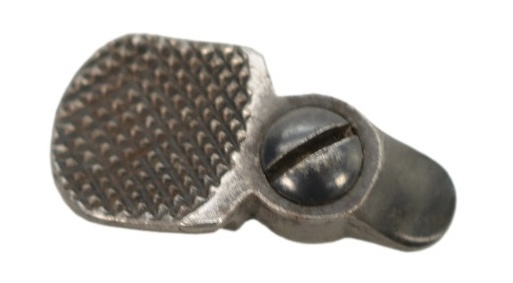
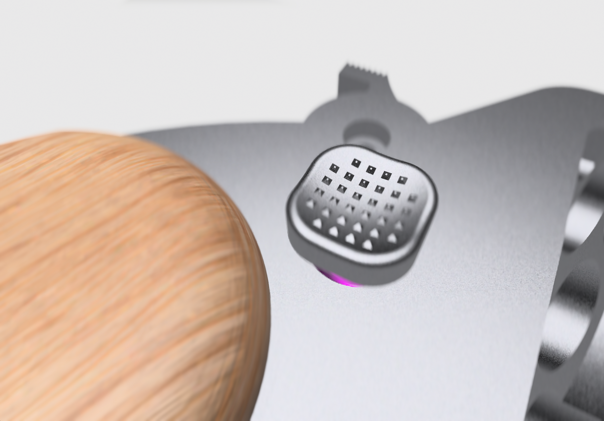
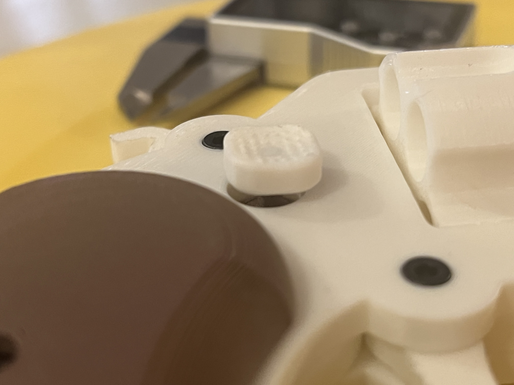
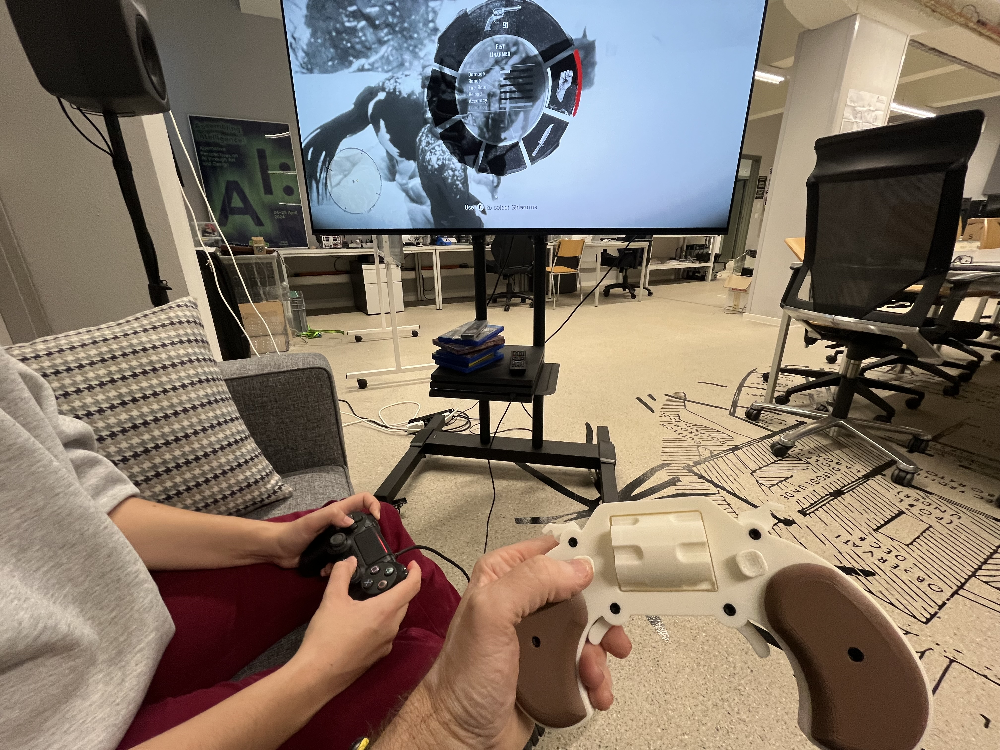
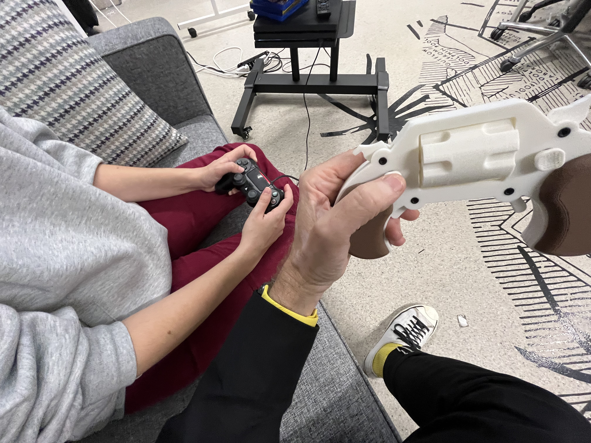

# Controller
Joystick, gamepad, joypad, stick, controller, call it whatever you want: we are going to build a custom controller for this project.

## Design
After many failed [experiments](./experiments/) by Douglas, Faust made the following drawing which placed us on the right path of exploring the shape of [Derringer](https://en.wikipedia.org/wiki/Derringer) pistols, as opposed to the [Colt](https://en.wikipedia.org/wiki/Colt_Single_Action_Army) family of pistols along with all it's bretheren.

## Early Mockup

## Render
A more recent render:

## User tests
Quick animation of hand movement test:

Excerpts of other hand tests:

Based on these tests, we are advancing with the 1.1x size, i.e. starting with the general outline of the Derringer frame, but multiplied 1.1x.

## GP2040-CE
Thanks to a suggestion by [ChatGPT 4o](https://openai.com/index/hello-gpt-4o/), we will start with the [GP2040-CE](https://gp2040-ce.info), a [Raspberry Pi](https://www.raspberrypi.com)-based project from [OpenStickCommunity](https://github.com/OpenStickCommunity). This project was designed to convert a Raspberry Pi into a low-latency USB controller. According to the [GP2040-CE Gitbub page](https://github.com/OpenStickCommunity/GP2040-CE), it can already emulate PS4 and PS5 controllers.

## USB Adapter
For now we will be using the GP2040 in standard HID PC Joystick mode, which requires using a [Brook Wingman FGC2 USB](https://www.amazon.de/Brook-FGC2-Controller-Adapter-kompatibel-PS5-Spielen-Schwarz-Wei%C3%9F/dp/B0DLWDY7MK) adaptor to emulate a PS4 controlller. But there is also a possibility of directly emulating a PS4 controller using the [OpenStickCommunity](https://github.com/OpenStickCommunity) solutions, but we will decide this at a later date. Using a GP2040 allows both options.

## Process
[Guillaume Stagnaro](https://www.stagnaro.net) is currently developping the controller circuit + final 3D CAD model. We are using [KiCAD](https://www.kicad.org) for the PCB development, and [JLC-PCB](https://jlcpcb.com/) + [LCSC](https://www.lcsc.com) for the circuit board production, including their pick-in-place solutions to order as well as place the entire circuit components on the board in one integrated solution. Guillaume is using [easyeda2kicad](https://github.com/uPesy/easyeda2kicad.py) to synchronize his work in KiCAD with the massive library of components at [LCSC](https://www.lcsc.com).

We will also use their [JLC-3DP](https://jlc3dp.com) service to cutout the physical controller frame in stainless steel (frame) and solid wood (stock handles). Guillaume is using a hybrid KiCAD + [Rhino3D](https://www.rhino3d.com) solution to integrate these two layers (circuit design + object design). Douglas is using [Shapr3D](https://www.shapr3d.com) based on Guillaume's [STEP](https://en.wikipedia.org/wiki/ISO_10303-21) files generated in Rhino3D, and constant test printing using [PrusaSlicer](https://www.prusa3d.com/page/prusaslicer_424/) and a [Prusa MK4S](https://www.prusa3d.com) / [Prusa One](https://www.prusa3d.com/product/prusa-core-one-kit).

# CAD Models
Although we have successfully used the mockups to make our choices concerning dimensions and fundamental shapes, there is still a lot of fine tuning required with the KiCAD circuit diagram and component selection and layout. Here is a folder with some of the latest mockups used to make our design decisions: [Cowpoke Controller models](./models/).

## Circuit
Current the circuit has the following components:

- USB connector
    - (USB-C? USB-A?)
- 2 x Thumbpads
- Audio amplifier
- Audio speaker
- Rotary encoder
- 12 buttons
    - 4 x North, South, East, West side buttons
    - 4 x Triangle, Circle, Square, Cross
    - 4 x Triggers (R1, R2, L1, L2)
- [Foster Vibration Actuator](https://www.foster-electric.com/products/vibration_actuator/)
- {TBD…}