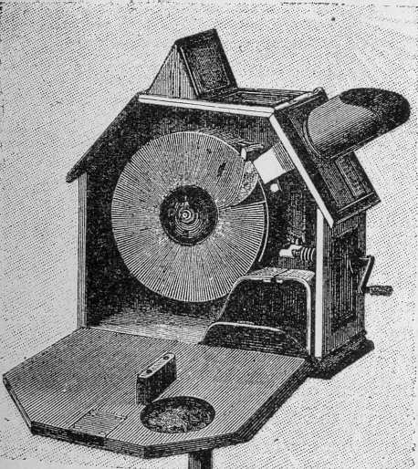

# Cowscope

I am currently working on a physical viewing device inspired by the [mutoscope](https://en.wikipedia.org/wiki/Mutoscope) — the 19th-century peephole flipbook machine. The cowscope accepts round cartridges in the center into which viewers can place a movie that has one frame per slot. Each frame is a single page from the flipbooks generated using the `crossing flipbook` system (cf. [crossing tool](../../code/crossing-tool/)).

