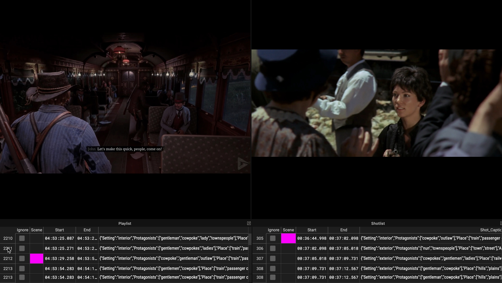
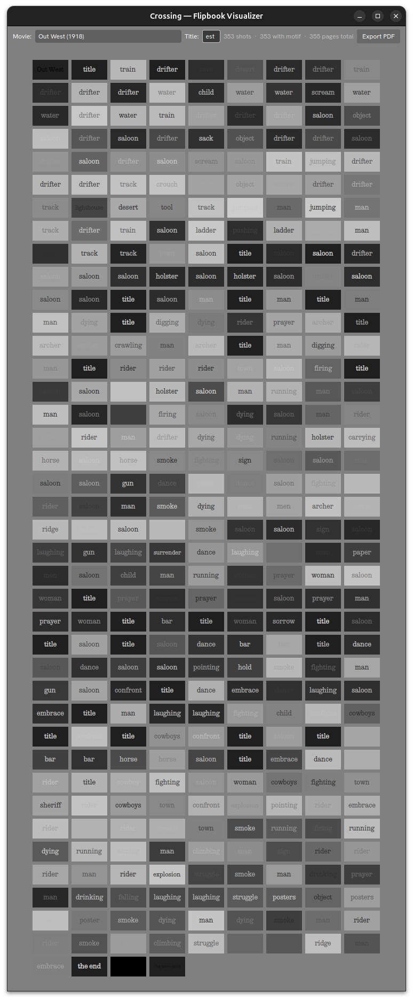

::: {.page .cover}

{.backdrop}

::: {.overlay .headline}

# DEAD CROSSING
## Playing the Ghosts of Western Cinema
### Douglas Edric Stanley

:::

:::

::: {.page .splash}

{.backdrop}

::: {.overlay .keyword}

# STANDOFF

:::

:::

::: {.page .text}

::: {.overlay .copy}

::: {.illustrations}

{.row-count-5}
{.row-count-1}
{.row-count-16}
{.row-count-1}

:::

## CROSSROADS

Cowpokes riding through the ghost town of an abandoned Western.
A cabin.
A crossroads.
Two mediums, revolvers drawn, caught in a deadly standoff.

Dead Crossing is an interactive installation where visitors explore the landscapes of an iconic popular Western video game, their movements triggering encounters with fragments drawn from more than three hundred Western films.

The video game becomes a real-time editing instrument. Each movement through the landscape generates new pathways through cinema history, assembling an endless film from the recurring images, gestures, characters, and myths of the American West.

Riding across a prairie, entering a saloon, boarding a train, or simply pausing before a distant horizon continuously generates new associations between video game imagery and cinema history. As visitors navigate the game world, they simultaneously navigate an archive of Western cinema, transforming gameplay into a form of live remix cinema.

## [DEMO](https://bit.ly/dead-crossing-cabin-demo)

- [youtu.be/L5ZbJvyN9hc](https://youtu.be/L5ZbJvyN9hc)

::: {.inline}

{.row-count-6}

:::

:::

:::

::: {.page .splash}

{.backdrop}

::: {.overlay .keyword}

# PLAYING THE LANDSCAPE

:::

:::

::: {.page .text}

::: {.overlay .copy}

::: {.illustrations}
{.row-count-6}
{.row-count-1}
{.row-count-6}
{.row-count-1}
:::

## EXPERIENCE

A visitor enters the cabin. Two screens open onto two mythological landscapes: on the left, a famous video game simulating the lawless West; on the right, fragments drawn from the history of Western cinema. Both screens seem to depict the same world — the same themes, objects, characters, and settings — but through the language of different media.

The visitor takes the custom-built controller from the wall and begins to play *Red Dead Redemption 2* (2018). Riding a horse, entering a saloon, crossing a river, or pausing before a distant horizon, their actions on the left-hand screen are mirrored by cinematic correspondences on the right.

Entering a cave in the game may trigger a cave sequence from the spaghetti western *10 000 Dollari Per Un Massacro* (1967). Emerging beside a waterfall may reveal a matching scene from *Johnny Guitar* (1954), where riders cross a pond beneath a cascading cliff.

Back and forth, the two screens remain in dialogue. As the player explores the virtual landscape, the system identifies motifs, settings, and situations -- displaying new pathways pulled from a century of Western cinema.

:::

:::

::: {.page .splash}

{.backdrop}

::: {.overlay .keyword}

# CABIN

:::

:::

::: {.page .text}

::: {.overlay .copy}

::: {.illustrations}
{.row-count-5}
{.row-count-1}
{.row-count-5}
{.row-count-1}
{.row-count-5}

:::

## THE FRAME

Reframing the imaginary landscapes of the West. The structure resembles a physicalized wireframe model: a cabin stripped of its protective shell, exposed to the elements.

Drawing on a lineage of autonomous architectures — the resistance architecture of Walden Pond, the frontier cabin of the Far West, the paranoiac cabin of the Unabomber Theodore Kaczynski — the cabin operates simultaneously as stage, viewing device, diagram, and shelter.

Entering the cabin, visitors find themselves suspended between several overlapping frontiers:

## FAR WEST

One frontier is the historical frontier of the "Far West": an iconographic landscape of cowpokes, outlaws, deserts, railroads, and the mythological iconography of desert and mountain landscapes. This frontier is an imaginary world-beyond-civilization, where ethics, laws, and society are open to interpretation.

## MEDIA CROSSINGS

Another frontier is a computationally enabled frontier, where one medium crosses the technical and aesthetic borders of another. This is frontier crossing: passing from one medium to another -- classical Hollywood cinema and contemporay interactive video games -- mediated by machine intelligence.

Dead Crossing transforms this open structure of superimposed frontiers into an impossible machine for dreaming the West: a device through which visitors can wander an ever-expanding landscape assembled from a century of Western mythology.

:::

:::

::: {.page .splash}

{.backdrop}

::: {.overlay .keyword}

# COWPOKE CONTROLLER

:::

:::

::: {.page .text}

::: {.overlay .copy}

::: {.illustrations}
{.row-count-5}
{.row-count-1}
{.row-count-6}
{.row-count-1}
{.row-count-5}
{.row-count-1}
{.row-count-5}
:::

## INSTRUMENT

A curious curatorial instrument disguised as a nineteenth-century firearm mechanism. The Cowpoke Controller is a custom interface developed specifically for *Dead Crossing*. Part video game controller, part cinematic editing device, part sculptural object, it invites visitors to physically navigate the landscapes and myths of Western cinema.

Designed using the mechanical vocabulary of nineteenth-century gunsmithing, the controller transforms gameplay into an act of navigation through cinema history. It combines design and material constraints of the period -- bronze, walnut -- with the precision machined milling, circuitboards, and pick-in-place industrial circuitboard manufacturing.

The rotating cylinder allows visitors to select from a carefully curated collection of iconic moments drawn from *Red Dead Redemption 2*: train robberies, frontier towns, hunting expeditions, campfires, saloons, duels, wilderness journeys, and other recurring figures of Western mythology.

Each selection becomes a new point of departure for traversing the installation's cross-indexed archive of cinema and gameplay. The controller functions simultaneously as a navigation device, a curatorial tool, and a mechanism for wandering through this latent landscape of the American West.

:::

:::

::: {.page .splash}

{.backdrop}

::: {.overlay .slogan}

# AN ARTIFICIAL GHOST WANDERS THE WESTERN FRONTIER

:::

:::

::: {.page .text}

::: {.overlay .copy}

::: {.illustrations}

{.row-count-9}
{.row-count-1}
{.row-count-17}

:::

## A HAUNTED LANDSCAPE

A specter haunts cinema, the spector of neural networks.

For more than a century, Western films have repeated and recombined a common repertoire of landscapes, characters, gestures, objects, and situations. Horses cross rivers. Trains arrive in frontier towns. Outlaws wait in saloons. Sheriffs confront strangers beneath wooden awnings. It is, in a sense, one of the pre-eminent examples of a proto-latent narrative engine, an active frontierland, well before the advent of AI.

The goal of the Playable Cinema research project is to tap into this modular space where icons can remix semantically and formally with other icons. Remix Cinema. But rather than tripping down the endless rabbit holes of generative AI slop, the project instead treates its foundational dataset with great respect. Here, machine learning is used to construct new relationships withing well-honed media formats. Inside of this latent and proto-latent space of Western iconograpy, an artificial spirit wanders through a century of iconography, identifying recurring visual motifs and tracing unexpected new pathways between films, videogames, and their common narratives.

This archive is not static. Interacting with the dataset allows visitors to not only remix the historical archive, but to construct their own bespoke narrative and thematic past that the system can then use to generate posters, mosaics, and even pulp Western novellas -- all based on user meanderings through the archive.

:::

:::

::: {.page .splash}

{.backdrop}

::: {.overlay .keyword}

# DATASET

:::

:::

::: {.page .text}

::: {.overlay .copy}

::: {.illustrations}
{.row-count-30}

:::

## CORPUS

- 300+ Western films
- 200+ hours of gameplay recordings
- 8'000+ vocabulary terms
- 250'000+ annotated shots
- 28'000+ detected scenes
- 500'000+ iconographic fragments

## ARCHIVE

More than three hundred Western films were collected, segmented, annotated, indexed, and transformed into a traversable archive. This process involved custom tools for dataset construction, shot and scene detection, subtitle processing, image annotation, vector search, and real-time synchronization.

## CATALOG

Rather than relying on fixed categories alone, the system combines human curation with machine learning to construct a vocabulary of recurring Western motifs: characters, objects, actions, locations, situations, and archetypes.

The resulting archive functions simultaneously as a dataset, a visual encyclopedia of Western iconography, and a traversable landscape of cinema history.

:::

:::

::: {.page .splash}

{.backdrop}

::: {.overlay .keyword}

# ENGINE

:::

:::

::: {.page .text}

::: {.overlay .copy}

::: {.illustrations}
{.row-count-24}
:::

## REMIX ENGINE

Dead Crossing is powered by a bespoke software environment developed within the Playable Cinema research project. The goal of this research project is to build methodologies and tools to leverage machine learning in the curation, analysis, and recombination of cinema and videogame narratives.

During the latest stage of this research, more than three hundred Western films were collected, segmented, annotated, indexed, and transformed into a traversable archive.

## REAL-TIME SYSTEM

As visitors play the game inside the cabin, the gameplay footage is continuously analysed and compared against the archive. As they move through the virtual landscape, the system identifies correspondences between gameplay situations and cinematic fragments drawn from hundreds of Western films.

Each journey through the installation produces a different cinematic trajectory through the archive.

## OPEN-SOURCE

The source code, documentation, and development notes of this software package can be downloaded at:

- [github.com/abstractmachine/head-irad-playable-cinema](https:/github.com/abstractmachine/head-irad-playable-cinema)

:::

:::

::: {.page .splash}

{.backdrop}

::: {.overlay .keyword}

# PIPELINE

:::

:::

::: {.page .text}

::: {.overlay .copy}

::: {.illustrations}
{.row-count-15}
:::

## PIPELINE

The archive is constructed through a multi-stage machine-learning pipeline specifically designed for moving-image analysis. Each film passes through a sequence of computational transformations:

- Shot detection
- Scene detection
- Subtitle processing
- Visual annotation
- Colormetric analysis
- Vocabulary extraction
- Semantic indexing
- Narratological descriptors
- Real-time synchronization

Films are first segmented into individual shots and scenes. Subtitles are synchronized and linked to image sequences. Vision-language models generate structured annotations describing actions, objects, characters, locations, and events.

These annotations are converted into vector embeddings, allowing visual and semantic relationships to be discovered across the entire corpus. These embeddings also allow the system to run locally, using far less ressources that cloud-based machine learning systems. The resulting archive can be locally searched, navigated, clustered, recomposed, and synchronized with live gameplay in real time, far from any ressource-dependant datacenters.

:::

:::

::: {.page .splash}

{.backdrop}

::: {.overlay .keyword}

# INSTALLATION

:::

:::

::: {.page .info}

::: {.overlay .copy}

::: {.illustrations}
:::

## SETUP

Installation and calibration typically require one working day. Artist coordination during installation is required.

## DIMENSIONS

**Installation extents**

* Width: 2500 mm
* Length: 3750 mm
* Height: 3450 mm

**Recommended exhibition area**

Minimum 5 × 5 m

## REQUIREMENTS

**Power**

110V / 230V AC

**Network**

Not required

**Venue requirements**

* Standard electrical connection
* Access during installation and deinstallation
* Basic exhibition supervision

**Provided by the artist**

* Cabin structure
* Cowpoke Controller
* Display system
* Computing hardware
* Software environment
* Media archive
* Installation documentation

Dead Crossing is a free-standing interactive installation composed of a custom-built timber cabin, integrated display system, bespoke controller, and software environment.

Designed for galleries, museums, festivals, and exhibition spaces, the installation invites visitors to enter a frontier cabin and navigate a playable archive of Western cinema.

The work is presented as a complete installation including cabin structure, controller, software environment, and media archive.

:::

:::

::: {.page .splash}

{.backdrop}

::: {.overlay .keyword}

# CREDITS

:::

:::

::: {.page .text}

::: {.overlay .copy}

::: {.illustrations}
:::

**Dead Crossing**  
2026

## TEAM

Concept, artistic direction, software development, installation design and production  
[**Douglas Edric Stanley**](https://abstractmachine.net/biography)
`douglas@abstractmachine.net`

Research assistance, annotation, documentation and production  
**Faust Perillaud**

Cowpoke Controller development  
**Guillaume Stagnaro**

Cabin construction consulting and production  
**Colin Castellano**

## FINANCING

Funded by the HES-SO Research Programme
**Réseau de Compétences Design et Arts visuels** | **RCDAV**

Research leadership and institutional support  
**Anthony Masure**  
Dean of Research, IRAD, HEAD – Genève, HES-SO

Research administration and coordination  
**Christelle Granite-Noble**  
IRAD, HEAD – Genève, HES-SO

:::

:::
