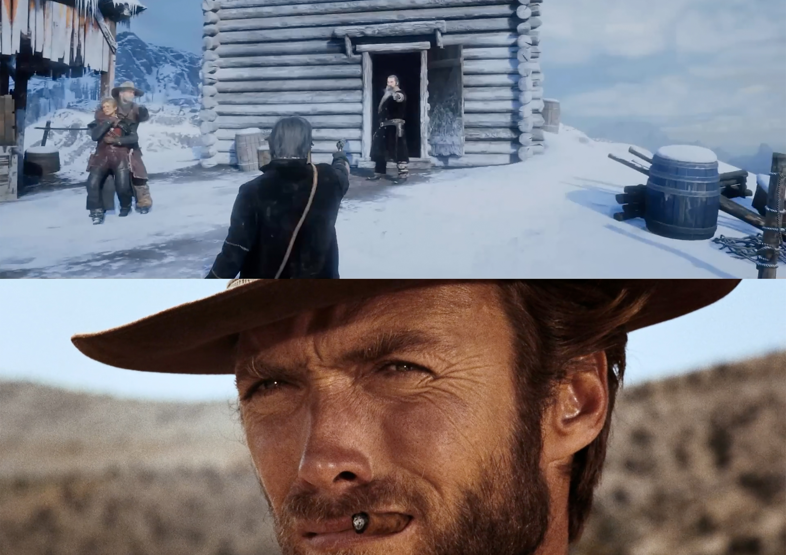
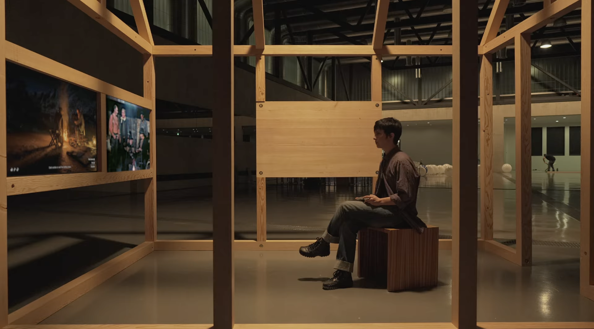
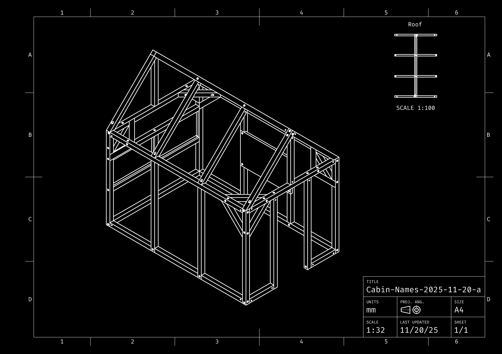
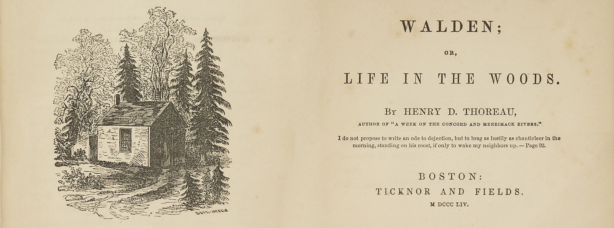
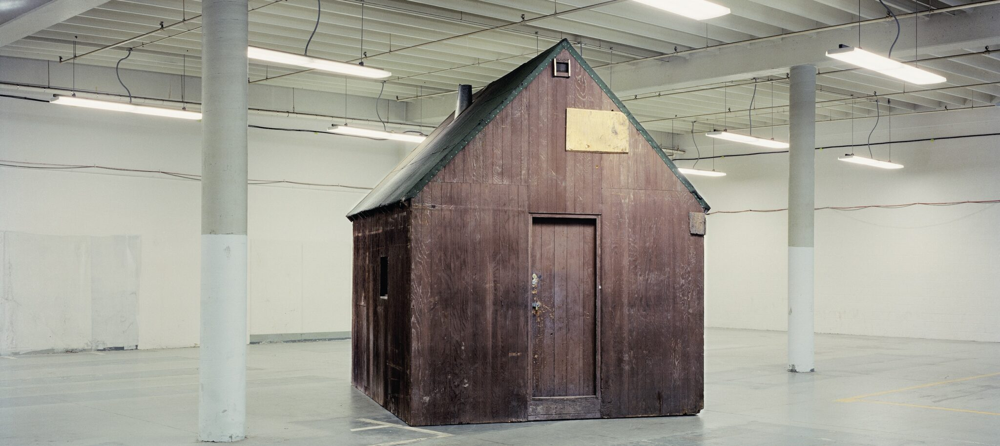
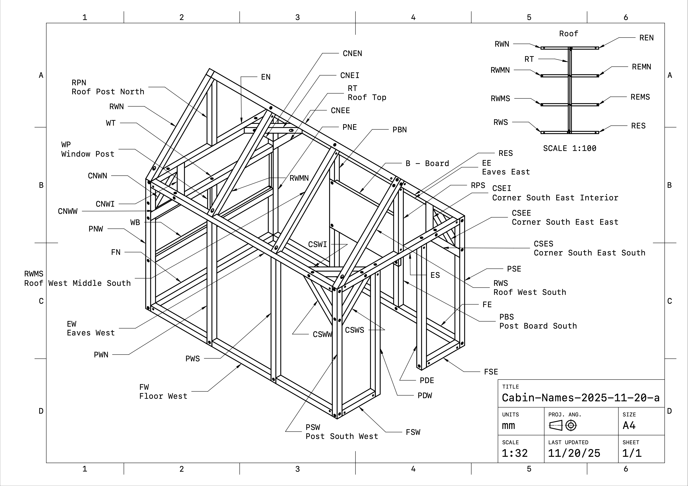
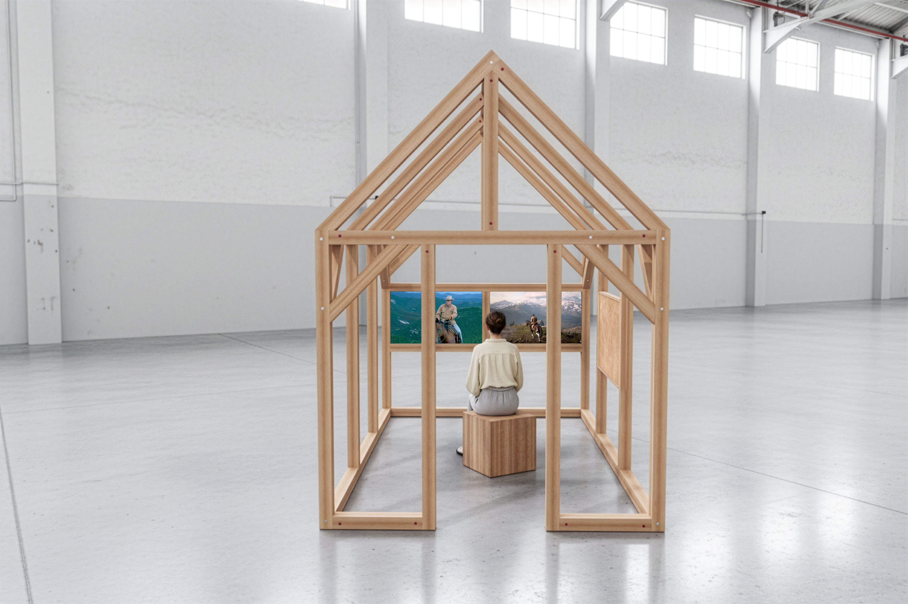
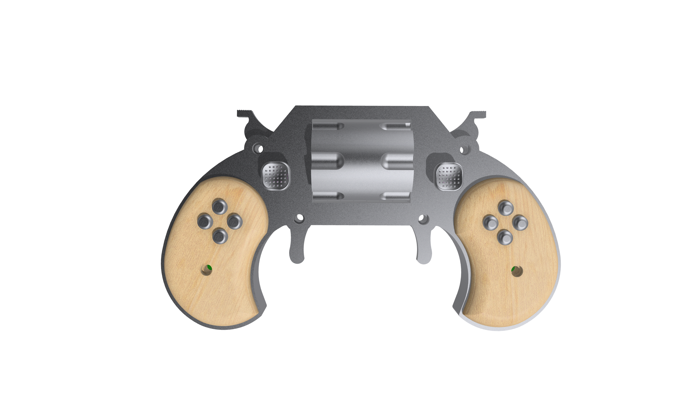
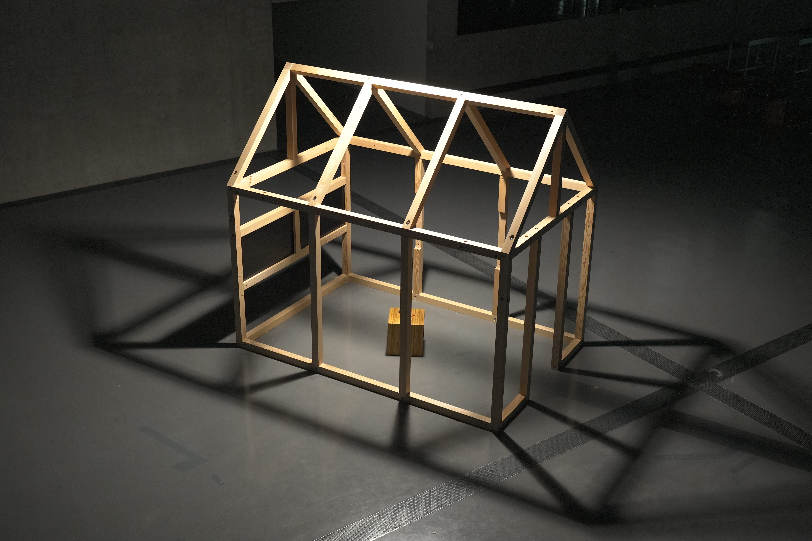

::: {.page .cover}

{.backdrop}

::: {.overlay .headline}

# DEAD CROSSING
## Playing the Ghosts of Western Cinema
### Douglas Edric Stanley

:::

:::

::: {.page .splash}

{.backdrop}

::: {.overlay .keyword}

# STANDOFF

:::

:::

::: {.page .text}

::: {.overlay .copy .illustrated}

::: {.illustrations}

{.row-count-5}
{.row-count-6}
{.row-count-1}

:::

## CROSSROADS

Cowpokes riding through the ghost town of an abandoned Western.
A cabin.
A crossroads.
Two mediums, revolvers drawn, caught in a deadly standoff.

## INSTALLATION

Dead Crossing is an interactive installation where visitors explore the landscapes of an iconic popular Western video game, their movements triggering encounters with fragments drawn from more than three hundred Western films.

## PLAYING THE EDIT

The video game becomes a real-time editing instrument. Each movement through the landscape generates new pathways through cinema history, assembling an endless film from the recurring images, gestures, characters, and myths of the American West.

## [DEMO](https://bit.ly/dead-crossing-cabin-demo)

Riding across a prairie, entering a saloon, boarding a train, or simply pausing before a distant horizon continuously generates new associations between video game imagery and cinema history. As visitors navigate the game world, they simultaneously navigate an archive of Western cinema, transforming gameplay into a form of live remix cinema.

- [youtu.be/L5ZbJvyN9hc](https://youtu.be/L5ZbJvyN9hc)

::: {.inline}

{.row-count-6}

:::

:::

:::

::: {.page .splash}

{.backdrop}

::: {.overlay .keyword}

# CABIN

:::

:::

::: {.page .text}

::: {.overlay .copy .illustrated}

::: {.illustrations}

{.row-count-6}
{.row-count-1}
{.row-count-6}
{.row-count-1}
{.row-count-6}
{.row-count-1}
{.row-count-6}

:::

## THE FRAME

Reframing the imaginary landscapes of the West. The structure resembles a physicalized wireframe model: a cabin stripped of its protections, exposed from all sides.

Drawing on a lineage of autonomous architectures—the resistance architecture of Walden Pond, the frontier cabin of the American West, the paranoiac cabin of Theodore Kaczynski—it operates simultaneously as stage, viewing device, diagram, and shelter.

Entering the cabin, visitors find themselves suspended between two frontiers. One is the historical frontier of the American West: a landscape of cowpoke, outlaws, deserts, railroads, and frontier mythology. The other is a computational frontier assembled from cinema, video games, archives, and machine intelligence.

Dead Crossing transforms this open structure into an impossible machine for dreaming the West: a device through which visitors can wander an ever-expanding landscape assembled from a century of Western mythology.

:::

:::

::: {.page .splash}

{.backdrop}

::: {.overlay .keyword}

# PLAYING THE LANDSCAPE

:::

:::

::: {.page .text}

::: {.overlay .copy .illustrated}

Visitors enter the cabin and navigate the virtual world of the popular Western video game *Red Dead Redemption 2* (2018) using a custom-built controller.

As they travel through the landscape, their actions continuously activate new pathways through a century of Western cinema. Riding a horse, entering a saloon, crossing a river, or pausing before a distant horizon can reveal unexpected correspondences between video game imagery and film history.

The installation transforms gameplay into a form of cinematic exploration. The visitor becomes simultaneously player, spectator, editor, and explorer.

:::

:::

::: {.page .splash}

{.backdrop}

::: {.overlay .keyword}

# COWPOKE CONTROLLER

:::

:::

::: {.page .text}

::: {.overlay .copy .illustrated}

::: {.illustrations}

{.row-count-12}

:::

## Instrument

A curious curatorial instrument disguised as a nineteenth-century firearm mechanism.

The Cowpoke Controller is a custom interface developed specifically for *Dead Crossing*.

Part video game controller, part cinematic editing device, part sculptural object, it invites visitors to physically navigate the landscapes and myths of Western cinema.

Designed using the mechanical vocabulary of nineteenth-century gunsmithing, the controller transforms gameplay into an act of navigation through cinema history.

The rotating cylinder allows visitors to select from a carefully curated collection of iconic moments drawn from *Red Dead Redemption 2*: train robberies, frontier towns, hunting expeditions, campfires, saloons, duels, wilderness journeys, and other recurring figures of Western mythology.

Each selection becomes a new point of departure for traversing the installation's cross-indexed archive of cinema and gameplay. The controller functions simultaneously as a navigation device, a curatorial tool, and a mechanism for wandering through this latent landscape of the American West.

:::

:::

::: {.page .splash}

{.backdrop}

::: {.overlay .slogan}

# AN ARTIFICIAL GHOST WANDERS THE WESTERN FRONTIER

:::

:::

::: {.page .text}

::: {.overlay .copy .illustrated}

## SOFTWARE

A machine-learning system trained to navigate a visual encyclopedia of Western iconography.

Dead Crossing is powered by a bespoke software environment developed as part of the Playable Cinema research project.

## MYTHOLOGY

Western cinema is built from a shared vocabulary of recurring figures, objects, gestures, situations, and landscapes. Each film rearranges these elements into a new variation of a common mythology.

## REAL-TIME SYNC

In the exhibition, live gameplay is continuously analysed and synchronized with this archive. As visitors move through the game world, the system assembles new pathways through a century of Western cinema, allowing the archive to be explored as a dynamic and playable landscape.

:::

:::

::: {.page .splash}

{.backdrop}

::: {.overlay .keyword}

# DATASET

:::

:::

::: {.page .text}

::: {.overlay .copy .illustrated}

## CORPUS

- 300+ Western films
- 200+ hours of gameplay recordings
- 8'000+ vocabulary terms
- 250'000+ annotated shots
- 28'000+ detected scenes
- 500'000+ iconographic fragments

## ARCHIVE

More than three hundred Western films were collected, segmented, annotated, indexed, and transformed into a traversable archive. This process involved custom tools for dataset construction, shot and scene detection, subtitle processing, image annotation, vector search, and real-time synchronization.

## CATALOG

Rather than relying on fixed categories alone, the system combines human curation with machine learning to construct a vocabulary of recurring Western motifs: characters, objects, actions, locations, situations, and archetypes.

The resulting archive functions simultaneously as a dataset, a visual encyclopedia of Western iconography, and a traversable landscape of cinema history.

:::

:::

::: {.page .splash}

{.backdrop}

::: {.overlay .keyword}

# CREDITS

:::

:::

::: {.page .text}

::: {.overlay .copy .illustrated}

**Dead Crossing**  
2026

## TEAM

Concept, artistic direction, software development, installation design and production  
**Douglas Edric Stanley**

Research assistance, annotation, documentation and production  
**Faust Perillaud**

Cowpoke Controller development  
**Guillaume Stagnaro**

Cabin construction consulting and production  
**Colin Castellano**

## FINANCING

Funded by the HES-SO Research Programme
**Réseau de Compétences Design et Arts visuels** | **RCDAV**

Research leadership and institutional support  
**Anthony Masure**  
Dean of Research, IRAD, HEAD – Genève, HES-SO

Research administration and coordination  
**Christelle Granite-Noble**  
IRAD, HEAD – Genève, HES-SO

:::

:::
