::: {.page .cover}

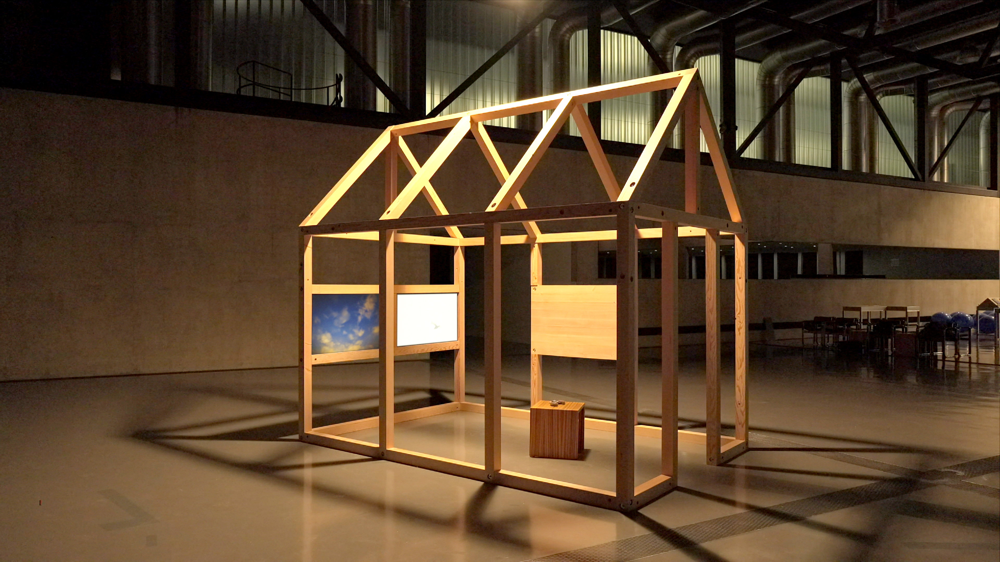{.backdrop}

::: {.overlay .headline}

# DEAD CROSSING
## Playing the Ghosts of Western Cinema
### Douglas Edric Stanley

:::

:::

::: {.page .splash}

{.backdrop}

::: {.overlay .keyword}

# STANDOFF

:::

:::

::: {.page .text}

::: {.overlay .copy}

::: {.illustrations}

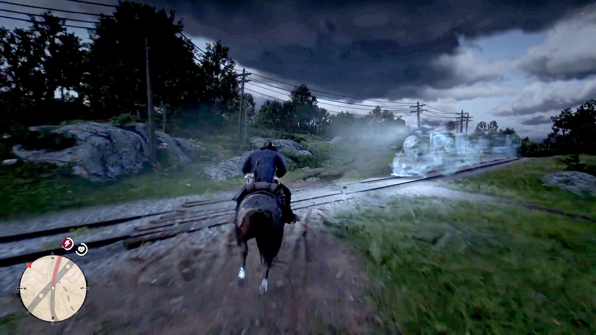{.row-count-6}
{.row-count-1}
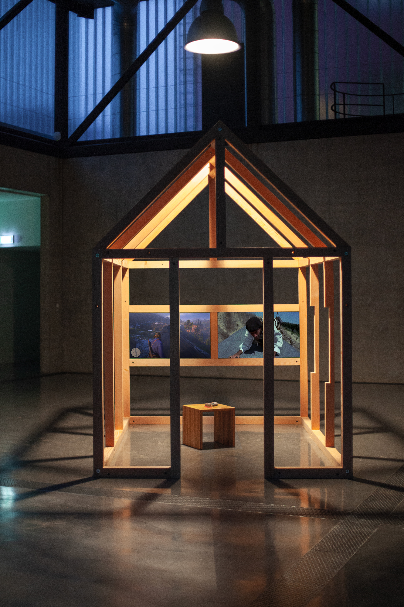{.row-count-16}
{.row-count-1}

:::

## CROSSROADS

Cowpokes riding through the ghost town of an abandoned Western.
A cabin.
A crossroads.
Two mediums, revolvers drawn, caught in a deadly standoff.

## INSTALLATION

Dead Crossing is an interactive installation where visitors explore the landscapes of an iconic popular Western video game, their movements triggering encounters with fragments drawn from more than three hundred Western films.

## PLAYING THE EDIT

The video game becomes a real-time editing instrument. Each movement through the landscape generates new pathways through cinema history, assembling an endless film from the recurring images, gestures, characters, and myths of the American West.

## [DEMO](https://bit.ly/dead-crossing-cabin-demo)

Riding across a prairie, entering a saloon, boarding a train, or simply pausing before a distant horizon continuously generates new associations between video game imagery and cinema history. As visitors navigate the game world, they simultaneously navigate an archive of Western cinema, transforming gameplay into a form of live remix cinema.

- [youtu.be/L5ZbJvyN9hc](https://youtu.be/L5ZbJvyN9hc)

::: {.inline}

{.row-count-6}

:::

:::

:::

::: {.page .splash}

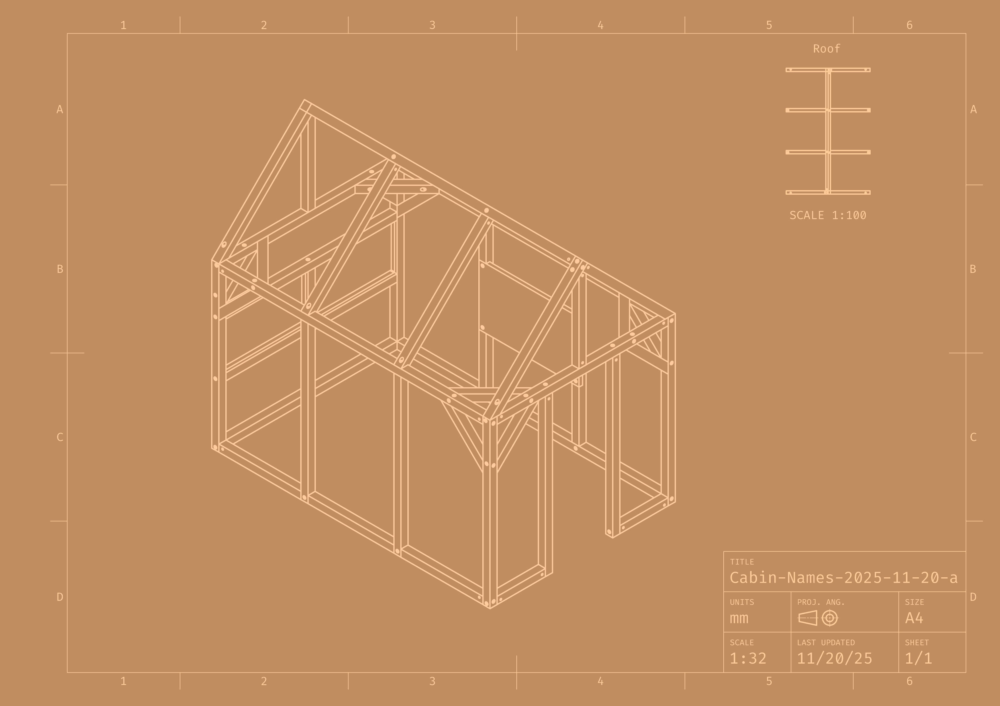{.backdrop}

::: {.overlay .keyword}

# CABIN

:::

:::

::: {.page .text}

::: {.overlay .copy}

::: {.illustrations}

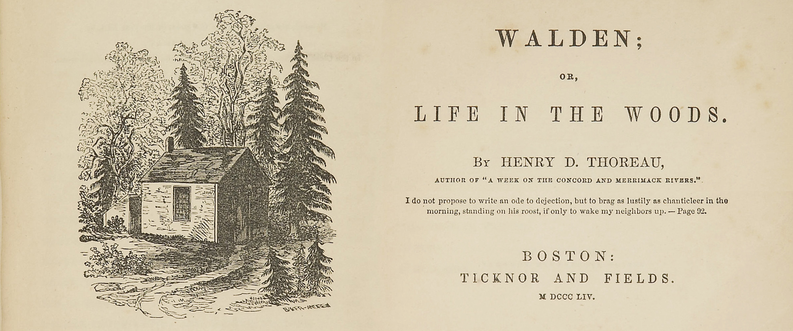{.row-count-6}
{.row-count-1}
{.row-count-6}
{.row-count-1}
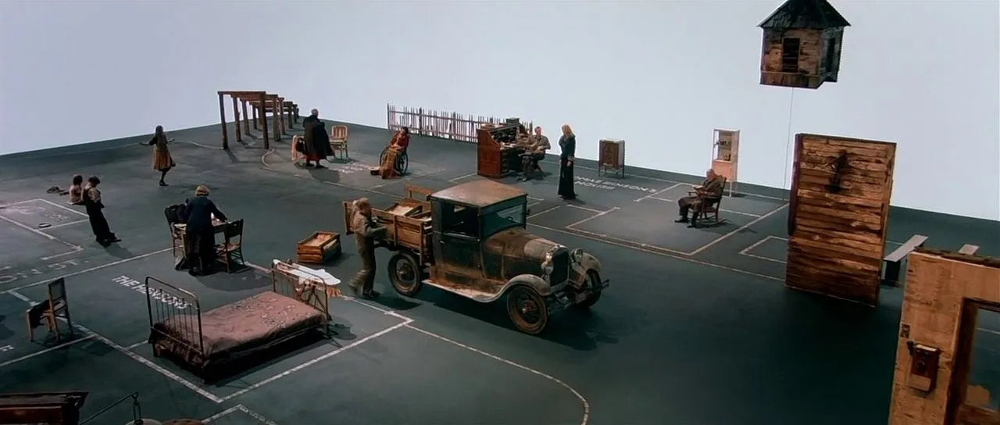{.row-count-6}

:::

## THE FRAME

Reframing the imaginary landscapes of the West. The structure resembles a physicalized wireframe model: a cabin stripped of its protections, exposed from all sides.

Drawing on a lineage of autonomous architectures—the resistance architecture of Walden Pond, the frontier cabin of the American West, the paranoiac cabin of Theodore Kaczynski—it operates simultaneously as stage, viewing device, diagram, and shelter.

Entering the cabin, visitors find themselves suspended between two frontiers. One is the historical frontier of the American West: a landscape of cowpoke, outlaws, deserts, railroads, and frontier mythology. The other is a computational frontier assembled from cinema, video games, archives, and machine intelligence.

Dead Crossing transforms this open structure into an impossible machine for dreaming the West: a device through which visitors can wander an ever-expanding landscape assembled from a century of Western mythology.

:::

:::

::: {.page .splash}

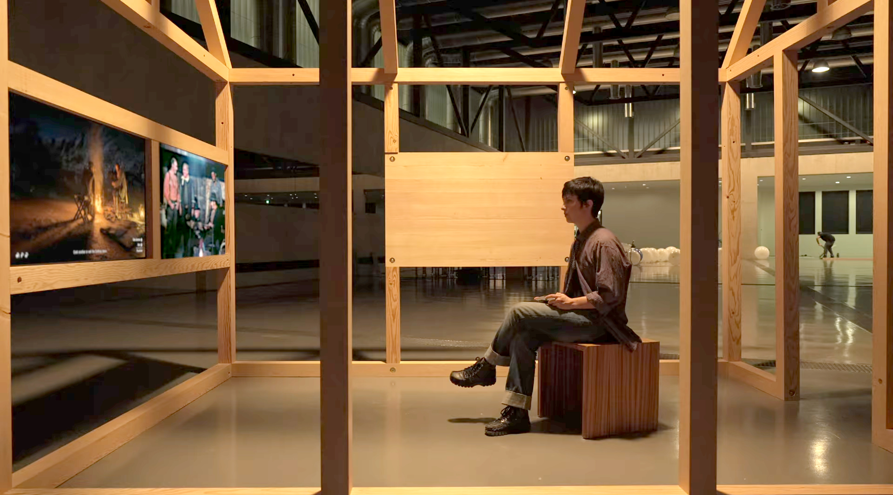{.backdrop}

::: {.overlay .keyword}

# PLAYING THE LANDSCAPE

:::

:::

::: {.page .text}

::: {.overlay .copy}

::: {.illustrations}
:::

## EXPERIENCE

Visitors enter the cabin and navigate the virtual world of the popular Western video game *Red Dead Redemption 2* (2018) using a custom-built controller.

As they travel through the landscape, their actions continuously activate new pathways through a century of Western cinema. Riding a horse, entering a saloon, crossing a river, or pausing before a distant horizon can reveal unexpected correspondences between video game imagery and film history.

The installation transforms gameplay into a form of cinematic exploration. The visitor becomes simultaneously player, spectator, editor, and explorer.

:::

:::

::: {.page .splash}

{.backdrop}

::: {.overlay .keyword}

# COWPOKE CONTROLLER

:::

:::

::: {.page .text}

::: {.overlay .copy}

::: {.illustrations}

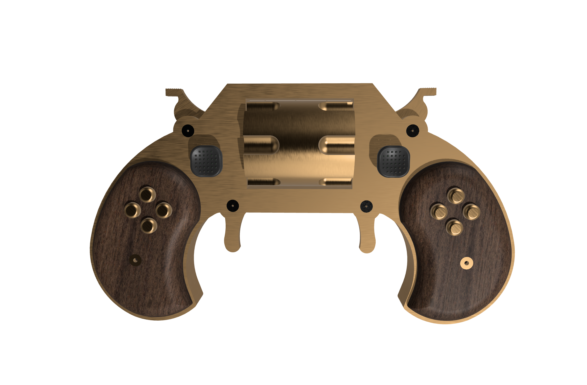{.row-count-6}
{.row-count-1}
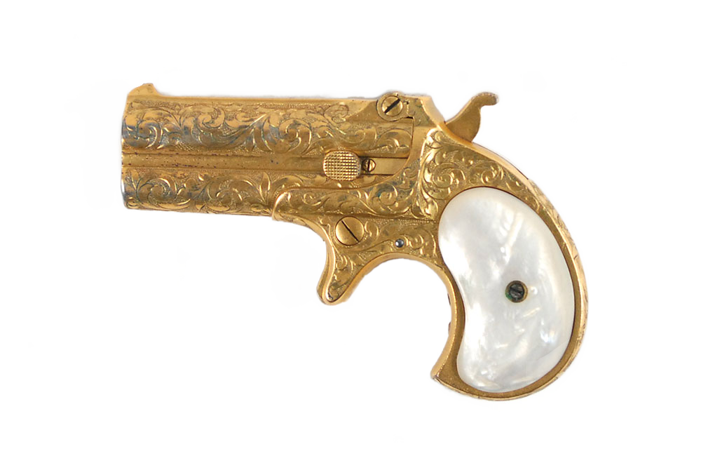{.row-count-6}
{.row-count-1}
{.row-count-6}
{.row-count-1}
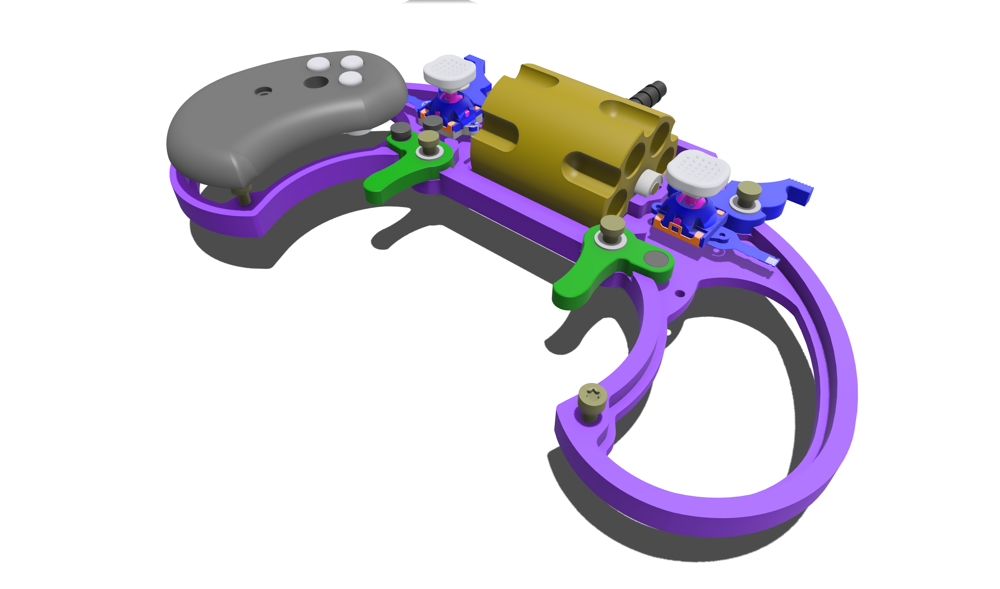{.row-count-6}
{.row-count-1}

:::

## INSTRUMENT

A curious curatorial instrument disguised as a nineteenth-century firearm mechanism. The Cowpoke Controller is a custom interface developed specifically for *Dead Crossing*. Part video game controller, part cinematic editing device, part sculptural object, it invites visitors to physically navigate the landscapes and myths of Western cinema.

Designed using the mechanical vocabulary of nineteenth-century gunsmithing, the controller transforms gameplay into an act of navigation through cinema history. It combines design and material constraints of the period -- bronze, walnut -- with the precision machined milling, circuitboards, and pick-in-place industrial circuitboard manufacturing.

The rotating cylinder allows visitors to select from a carefully curated collection of iconic moments drawn from *Red Dead Redemption 2*: train robberies, frontier towns, hunting expeditions, campfires, saloons, duels, wilderness journeys, and other recurring figures of Western mythology.

Each selection becomes a new point of departure for traversing the installation's cross-indexed archive of cinema and gameplay. The controller functions simultaneously as a navigation device, a curatorial tool, and a mechanism for wandering through this latent landscape of the American West.

:::

:::

::: {.page .splash}

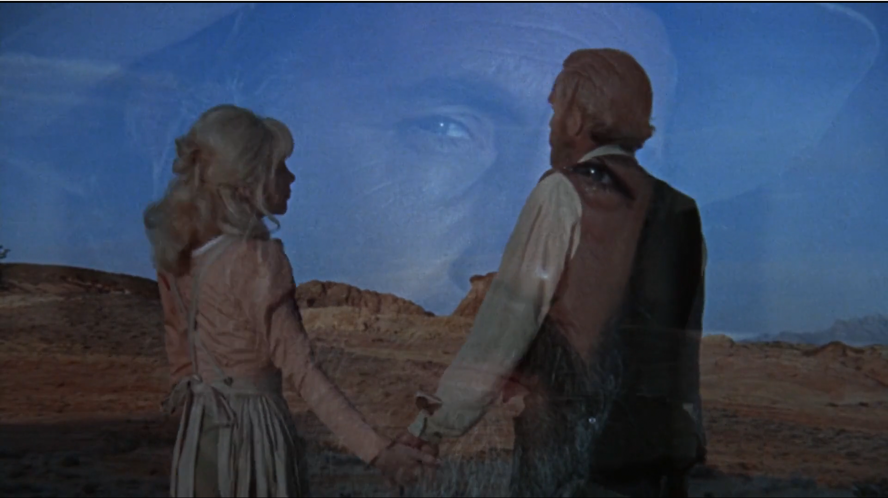{.backdrop}

::: {.overlay .slogan}

# AN ARTIFICIAL GHOST WANDERS THE WESTERN FRONTIER

:::

:::

::: {.page .text}

::: {.overlay .copy}

::: {.illustrations}

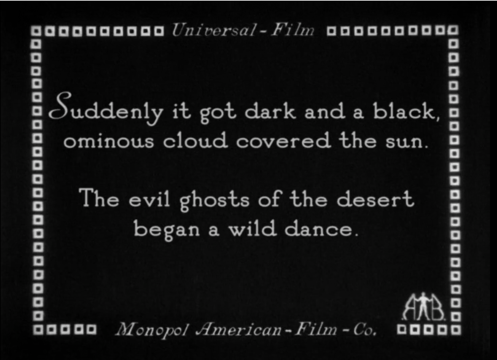{.row-count-9}
{.row-count-1}
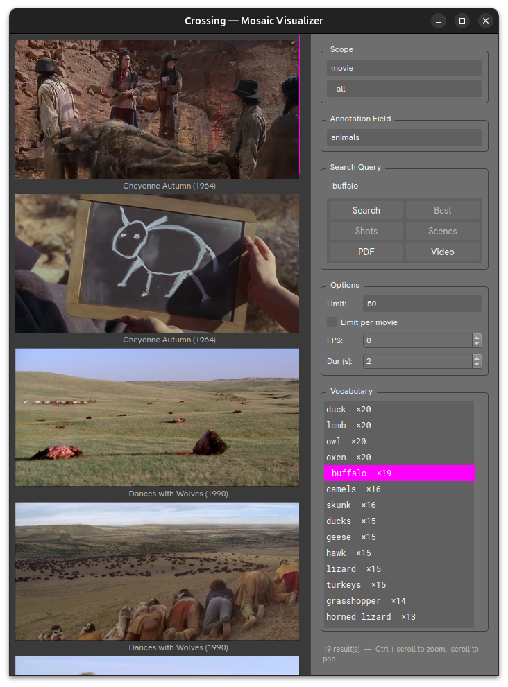{.row-count-17}

:::

## A HAUNTED LANDSCAPE

Western cinema is haunted by its own images.

For more than a century, Western films have repeated and recombined a common repertoire of landscapes, characters, gestures, objects, and situations. Horses cross rivers. Trains arrive in frontier towns. Outlaws wait in saloons. Sheriffs confront strangers beneath wooden awnings.

Dead Crossing treats this accumulated history as a navigable territory.

Rather than generating new images, the project uses machine learning to construct relationships between existing ones. An artificial spirit wanders through a century of Western cinema, identifying recurring visual motifs and tracing unexpected pathways between films, videogames, and archives.

The result is neither database nor film, but a dynamic system for exploring the mythology of the American West through interaction.

This archive is not static. Interacting with the dataset allows visitors to not only remix the historical archive, but to construct their own bespoke narrative and thematic past that the system can then use to generate posters, mosaics, and even pulp Western novellas -- all based on user meanderings through the archive.

:::

:::

::: {.page .splash}

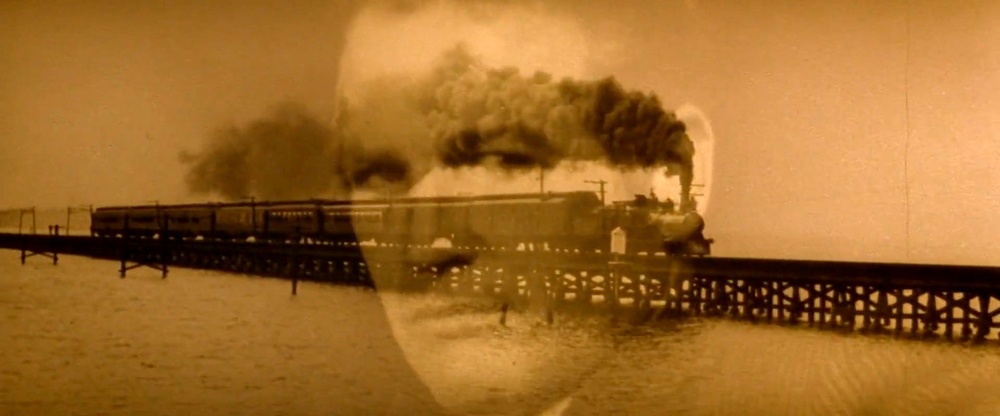{.backdrop}

::: {.overlay .keyword}

# ENGINE

:::

:::

::: {.page .text}

::: {.overlay .copy}

::: {.illustrations}
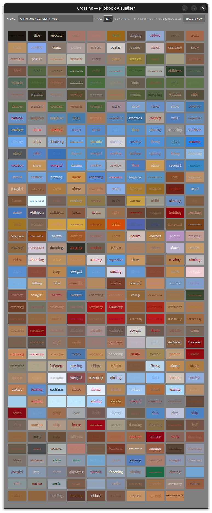{.row-count-24}
:::

## REMIX ENGINE

Dead Crossing is powered by a bespoke software environment developed within the Playable Cinema research project. The goal of this research project is to build methodologies and tools to leverage machine learning in the curation, analysis, and recombination of cinema and videogame narratives.

During the latest stage of this research, more than three hundred Western films were collected, segmented, annotated, indexed, and transformed into a traversable archive. Each film passes through a sequence of computational transformations:

* Shot detection
* Scene detection
* Subtitle processing
* Visual annotation
* Colormetric analysis
* Vocabulary extraction
* Semantic indexing
* Narratological descriptors
* Real-time synchronization

Together these processes transform a film archive into a playable cinematic landscape.

:::

:::

::: {.page .splash}

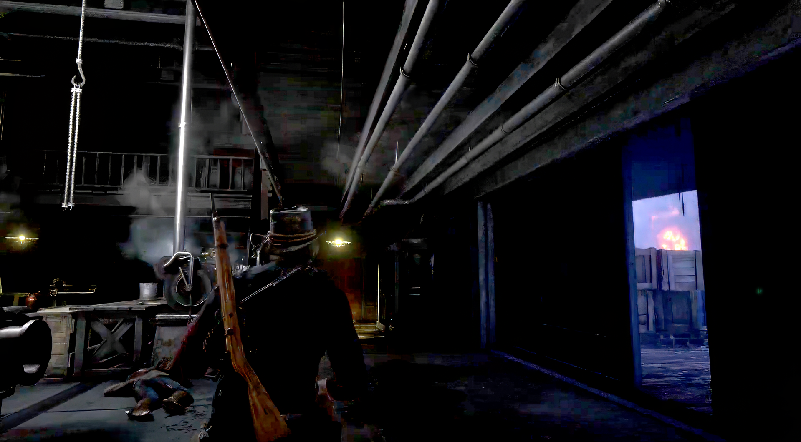{.backdrop}

::: {.overlay .keyword}

# PIPELINE

:::

:::

::: {.page .text}

::: {.overlay .copy}

::: {.illustrations}
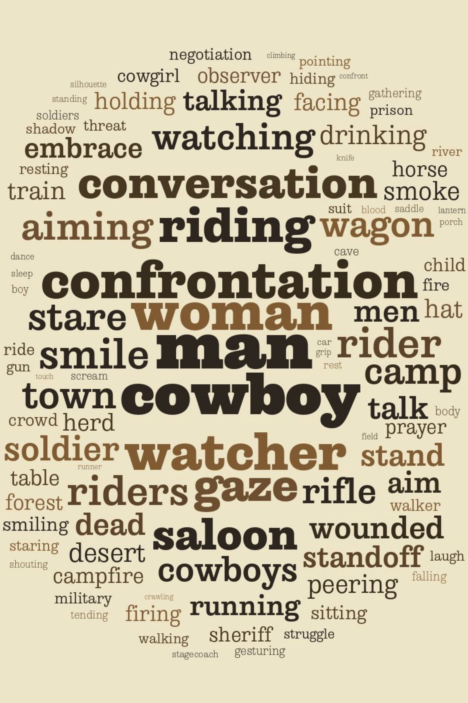{.row-count-15}
{.row-count-1}
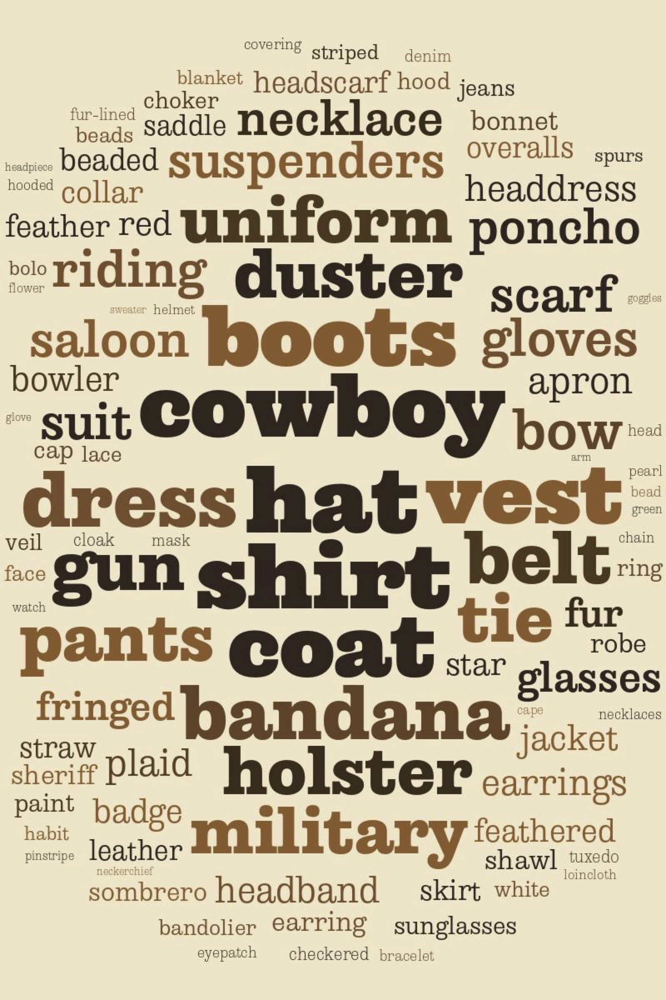{.row-count-15}
:::

## PIPELINE

The archive is constructed through a multi-stage machine-learning pipeline specifically designed for moving-image analysis.

Films are first segmented into individual shots and scenes. Subtitles are synchronized and linked to image sequences. Vision-language models generate structured annotations describing actions, objects, characters, locations, and events.

These annotations are converted into vector embeddings, allowing visual and semantic relationships to be discovered across the entire corpus.

The resulting archive can be searched, navigated, clustered, recomposed, and synchronized with live gameplay in real time.

## REAL-TIME SYSTEM

During exhibition, gameplay footage is continuously analysed and compared against the archive.

As visitors move through the virtual landscape, the system identifies correspondences between gameplay situations and cinematic fragments drawn from hundreds of Western films.

Each journey through the installation produces a different cinematic trajectory through the archive.

:::

:::

::: {.page .splash}

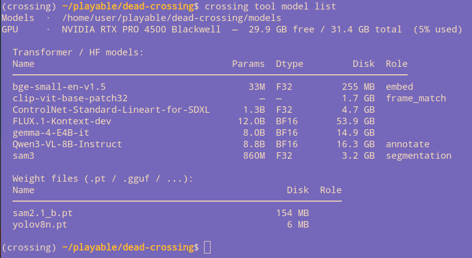{.backdrop}

::: {.overlay .keyword}

# MODELS

:::

:::

::: {.page .text}

::: {.overlay .copy}

::: {.illustrations}
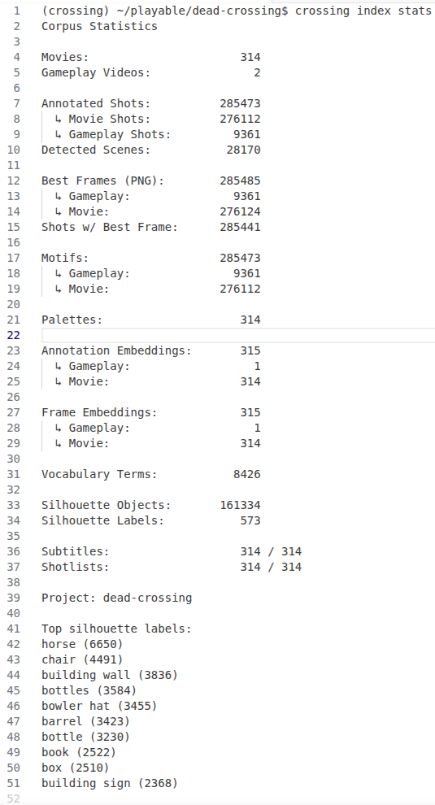{.row-count-30}
:::

## COMPUTER VISION

**TransNetV2**
Automatic shot-boundary detection.

**SAM (Segment Anything)**
Object segmentation and silhouette extraction.

**CLIP**
Image-text similarity, frame retrieval, visual synchronization.

## LANGUAGE MODELS

**Qwen**
Shot annotation, scene annotation, motif generation.

## EMBEDDING MODELS

**BGE**
Semantic indexing, similarity search, scene clustering.

## MEDIA PROCESSING

**FFmpeg**
Video transcoding, frame extraction, subtitle synchronization.

**OpenCV**
Image analysis, visualization, real-time processing.

## SOFTWARE ARCHITECTURE

The Crossing Tool software environment combines classical computer vision, large language models, semantic search, vector databases, and real-time synchronization into a unified platform for exploring relationships between cinema and videogames. No single model understands the archive. Dead Crossing emerges from the interaction between many specialized systems, each contributing a different way of seeing, describing, segmenting, indexing, or navigating moving images.

:::

:::

::: {.page .splash}

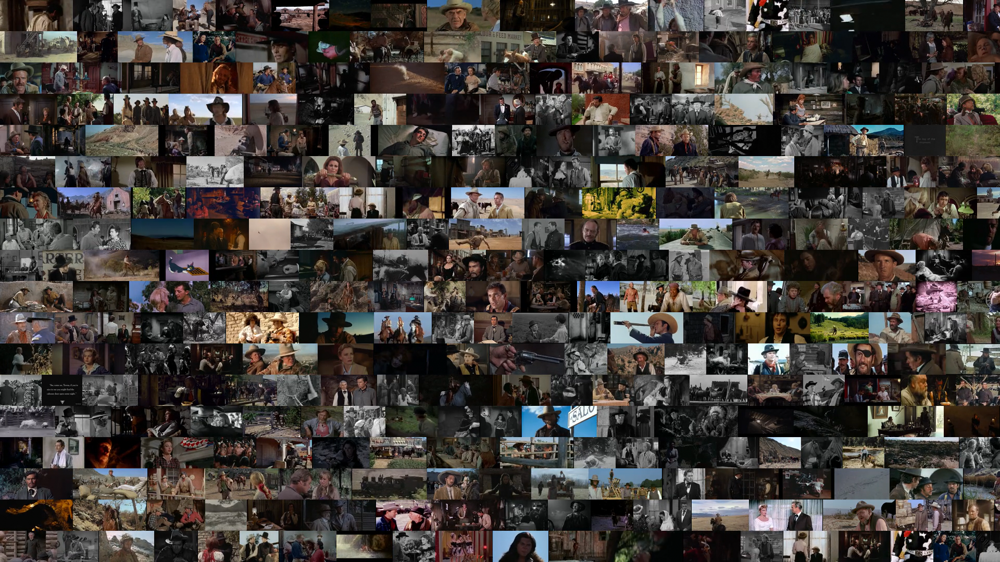{.backdrop}

::: {.overlay .keyword}

# DATASET

:::

:::

::: {.page .text}

::: {.overlay .copy}

::: {.illustrations}
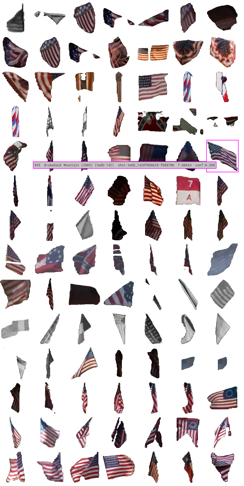{.row-count-30}

:::

## CORPUS

- 300+ Western films
- 200+ hours of gameplay recordings
- 8'000+ vocabulary terms
- 250'000+ annotated shots
- 28'000+ detected scenes
- 500'000+ iconographic fragments

## ARCHIVE

More than three hundred Western films were collected, segmented, annotated, indexed, and transformed into a traversable archive. This process involved custom tools for dataset construction, shot and scene detection, subtitle processing, image annotation, vector search, and real-time synchronization.

## CATALOG

Rather than relying on fixed categories alone, the system combines human curation with machine learning to construct a vocabulary of recurring Western motifs: characters, objects, actions, locations, situations, and archetypes.

The resulting archive functions simultaneously as a dataset, a visual encyclopedia of Western iconography, and a traversable landscape of cinema history.

:::

:::

::: {.page .splash}

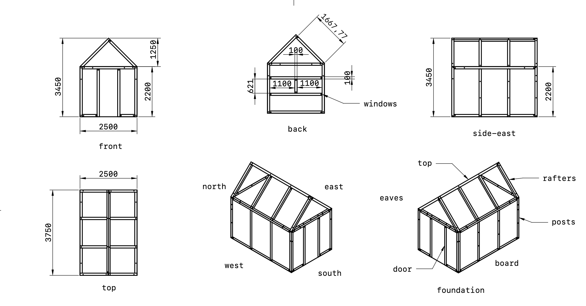{.backdrop}

::: {.overlay .keyword}

# HARDWARE

:::

:::

::: {.page .info}

::: {.overlay .copy}

::: {.illustrations}
:::

## INSTALLATION

Dead Crossing is a free-standing interactive installation composed of a custom-built timber cabin, integrated display system, bespoke controller, and software environment.

Designed for galleries, museums, festivals, and exhibition spaces, the installation invites visitors to enter a frontier cabin and navigate a playable archive of Western cinema.

The work is presented as a complete installation including cabin structure, controller, software environment, and media archive.

## DIMENSIONS

**Installation extents**

* Width: 2500 mm
* Length: 3750 mm
* Height: 3450 mm

**Recommended exhibition area**

Minimum 5 × 5 m

**Visitor capacity**

1 active participant
Additional surrounding audience possible

## REQUIREMENTS

**Power**

110V / 230V AC

**Network**

Not required

**Venue requirements**

* Standard electrical connection
* Access during installation and deinstallation
* Basic exhibition supervision

**Provided by the artist**

* Cabin structure
* Cowpoke Controller
* Display system
* Computing hardware
* Software environment
* Media archive
* Installation documentation

## SETUP

Installation and calibration typically require one working day.

Artist participation during installation is recommended.

:::

:::

::: {.page .splash}

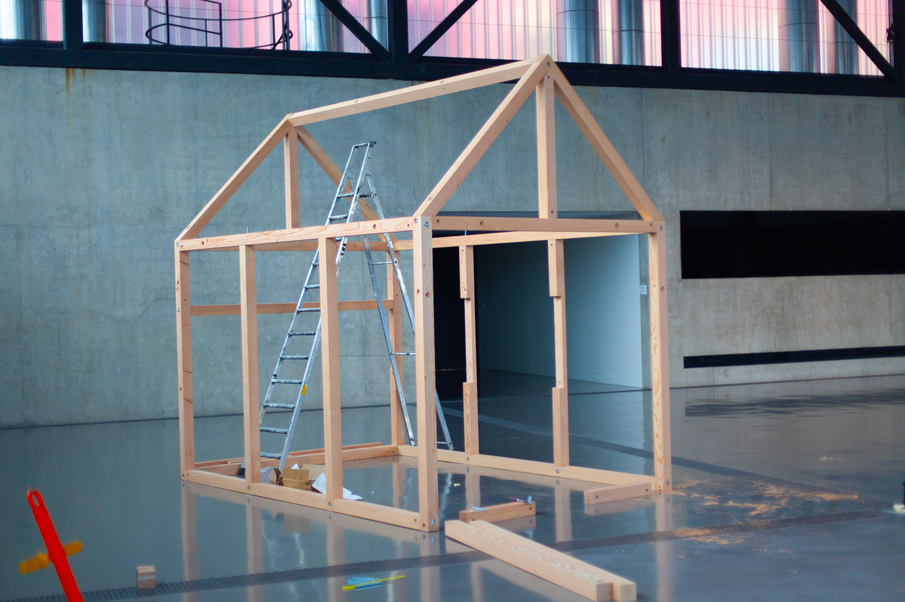{.backdrop}

::: {.overlay .keyword}

# CREDITS

:::

:::

::: {.page .text}

::: {.overlay .copy}

::: {.illustrations}
:::

**Dead Crossing**  
2026

## TEAM

Concept, artistic direction, software development, installation design and production  
**Douglas Edric Stanley**

Research assistance, annotation, documentation and production  
**Faust Perillaud**

Cowpoke Controller development  
**Guillaume Stagnaro**

Cabin construction consulting and production  
**Colin Castellano**

## FINANCING

Funded by the HES-SO Research Programme
**Réseau de Compétences Design et Arts visuels** | **RCDAV**

Research leadership and institutional support  
**Anthony Masure**  
Dean of Research, IRAD, HEAD – Genève, HES-SO

Research administration and coordination  
**Christelle Granite-Noble**  
IRAD, HEAD – Genève, HES-SO

:::

:::
