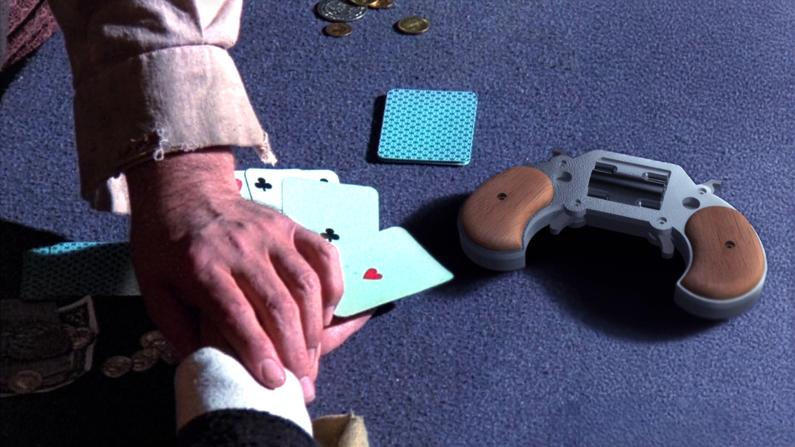
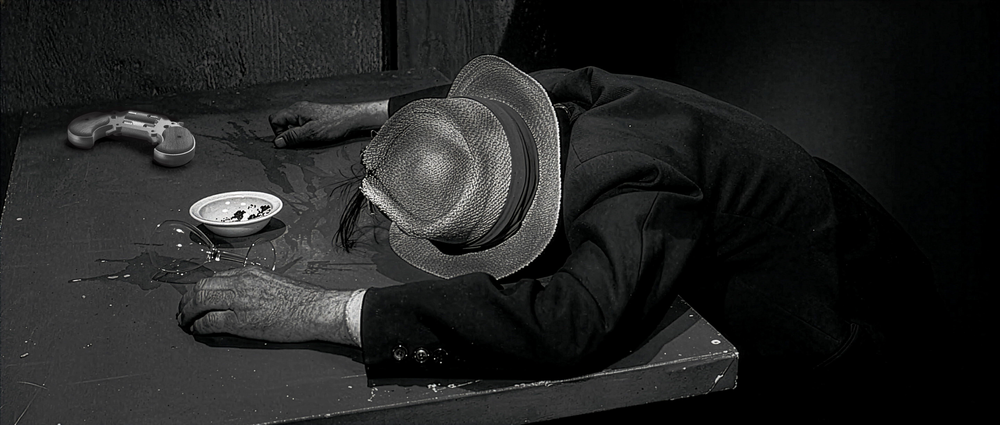

# Playable Cinema
- [Douglas Edric Stanley](https://abstractmachine.net/en/biography) & Faust Perillaud
- Conference
- [From Mimesis To Machine](https://www.istitutosvizzero.it/conferenza/from-mimesis-to-machine/)
- Istituto Svizzero, Roma
- November 27, 2025

Cowpokes riding through the ghost town of an abandoned Western landscape. At its heart, an isolated cabin with two solitary frames staring out onto the flickering plains of a mythology as it fades to red. A crossroads, two mediums staring the other down, revolvers drawn, caught in a deadly standoff.

Playable Cinema is a research project exploring how artificial intelligence can ride the invisible frontier between cinema history and interactive gameplay. Using machine learning to analyze hundreds of Westerns, it constructs a generative database where fragments of film history and the streams of live gameplay bleed into one another; where the joystick becomes an editing tool for an infinite Western fever dream looping through the ghosts of cinematic history.

At Istituto Svizzero, the team will show the behind-the-scenes logic of their audiovisual remix engine, and explore the new curatorial methodologies that are beginning to emerge as generative tools collaborate with humans in assembling the haunted archive of our shared hallucinations of the West.

## Images

Cowpoke Controller, Playable Cinema Project, IRAD, HEAD – Genève

Cowpoke Controller, Playable Cinema Project, IRAD, HEAD – Genève

Cowpoke Controller, Playable Cinema Project, IRAD, HEAD – Genève

Cowpoke Cabin, Playable Cinema Project, IRAD, HEAD – Genève

Cowpoke Cabin, Playable Cinema Project, IRAD, HEAD – Genève

## Team
- [Douglas Edric Stanley](https://abstractmachine.net/en/biography), Project Lead, [Maître d'enseignement](https://www.hesge.ch/head/annuaire/douglas-edric-stanley), [HEAD – Genève](https://www.hesge.ch/head/), HES-SO
- Faust Perillaud, Research Assistant, [HEAD – Genève](https://www.hesge.ch/head/), HES-SO
- [Guillaume Stagnaro](https://stagnaro.net), Cowpoke Controller Development

## Financing
This project was financed with a research grant from the [Network of Expertise in Design and Visual Arts](https://www.hesge.ch/head/en/programs-research/research) / [Réseau de compétences Design et Arts visuels](https://www.hesge.ch/head/formations-recherche/recherche).

## HEAD – Genève
- [Anthony Masure](https://www.anthonymasure.com), Dean of Research, [IRAD](https://www.hesge.ch/head/en/programs-research/research), [HEAD – Genève](https://www.hesge.ch/head/en), [HES-SO](https://www.hes-so.ch/)
- [Christelle Granite-Noble](https://www.hesge.ch/head/annuaire/christelle-granite-noble), Administrative Coordination, [IRAD](https://www.hesge.ch/head/en/programs-research/research), [HEAD – Genève](https://www.hesge.ch/head/en), [HES-SO](https://www.hes-so.ch/)
