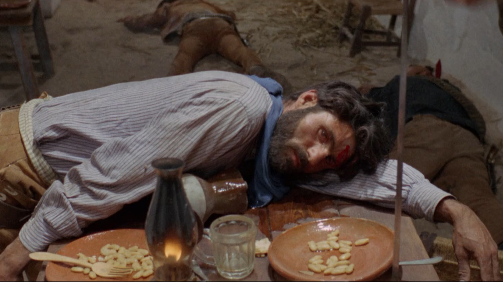

###### Playable Cinema
Faust Perillaud & Douglas Edric Stanley
Institut de recherche en art et design
HEAD – Genève | HES-SO

**Istituto Svizzero**
Rome | 27 November 2025

---

## DEAD

<!-- These are presenter notes -->

---

> This book is my attempt to philosophically examine some of the underlying positions on which the ethics of the Western are constructed. I am especially interested in what lessons might be learned from these movies about the relationship between one's conception of death and the moral position one adopts.
> –Cowboy Metaphysics, Peter A. French, 1998

<!-- This is a quote from a book which significantly influenced our reading of the ontological nature of westerns — the genre's internal mythology if you will. -->

---

<video src="./videos/fire.mp4" controls autoplay></video>

---

###### End