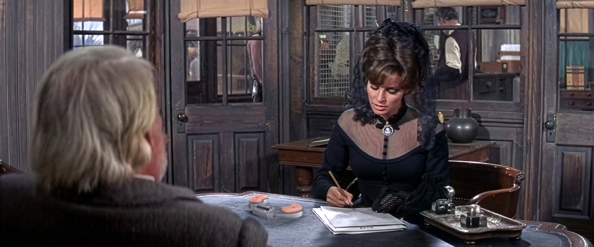
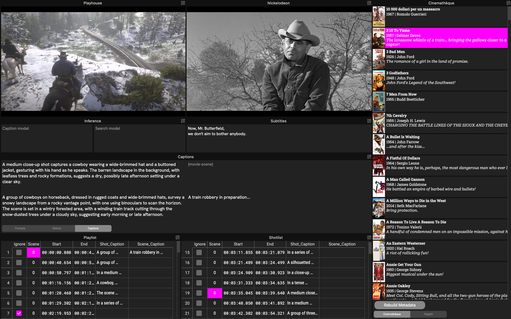

# Playable Cinema

## Project
Cowpokes riding through the ghost town of an abandoned Western. Isolated cabin, solitary frames, staring out onto the flickering plains of a mythology fading to red. A crossroads. Two mediums, revolvers drawn, caught in a deadly standoff.

Playable Cinema is a research project exploring how artificial intelligence can ride the invisible frontier between cinema history and interactive gameplay. By using machine learning to analyze hundreds of Westerns, the project constructs a generative database where fragments of film history and the streams of live gameplay bleed into one another; where the joystick becomes an editing tool for an infinite Western fever dream looping through the ghosts of cinematic history.

The project began by building a dataset that connects patterns between dystopian cinema and the award-winning indie game *Inside* (Playdead, 2016). This installation has been exibited in various locations and contexts (San Francisco, Lausanne, Marseille, Genève, …). This testbed served as a prototype for a larger-scale dataset comparing Western films and the iconic western video game, *Red Dead Redemption 2*.

In this current form, the project explores how hybrid strategies can emerge new curatorial methodologies as generative tools collaborate with humans in assembling the haunted archive of our shared hallucinations of the West.

## Team
- [Douglas Edric Stanley](https://abstractmachine.net), Project Lead
- [Faust Perillaud](https://2024.head-geneve.show/en/projects/spectral-yard-fp-100e1), Research Assistant, training & labelling
- [Guillaume Stagnaro](https://www.stagnaro.net), [Cowpoke Controller](./hardware/cowpoke-controller/) Developer

## Software
A [training and playback tool](./code/playable-tool/) is currently in development.

## Cabin
A [cabin](./hardware/cowpoke-cabin/readme.md) is currently in production that integrates all the parts of the project.

Blueprints to build this cabin can be found in the repository [hardware/cowpoke-cabin](./hardware/cowpoke-cabin/blueprints/)

## Hardware
A [physical object](./hardware/cowpoke-controller/readme.md) is currently in developement. This allows visitors to interact with the installation.

CAD model files and KiCAD circuit diagram can be found in [hardware/cowpoke-controller](./hardware/cowpoke-controller/)

## Westerns
There is a [list of the western films](./cineclub/README.md) we are using to train the deep learning models of this project.

## Current Status & Timeline
- **Test Phase (Q2 2025):** Annotating sequences from *Inside* using Roboflow and SAM tools.
- **Training Prototype Model (Q3 2025):** Building initial inference pipeline and testing labeling workflow.
- **Scaling Up (Q3 2025):** Transitioning to a larger dataset involving Western films and *Red Dead Redemption 2*.
- **Deployment (Q4 2025):** Developing interactive installation, annotation tool and real-time inference API.

## External Resources
- [Project overview & context](https://abstractmachine.net/en/posts/inside-inside)  
- [Teaser video (Inside Inside)](https://vimeo.com/589844238)  
- [GIFF Festival installation (2021)](https://www.giff.ch/archives/2021/)

## HEAD – Genève
- [Anthony Masure](https://www.anthonymasure.com), Dean of Research, [IRAD](https://www.hesge.ch/head/en/programs-research/research), [HEAD – Genève](https://www.hesge.ch/head/en), [HES-SO](https://www.hes-so.ch/)
- [Christelle Granite-Noble](https://www.hesge.ch/head/annuaire/christelle-granite-noble), Administrative Coordination, [IRAD](https://www.hesge.ch/head/en/programs-research/research), [HEAD – Genève](https://www.hesge.ch/head/en), [HES-SO](https://www.hes-so.ch/)

## Financing
This project was financed with a research grant from the [Network of Expertise in Design and Visual Arts](https://www.hesge.ch/head/en/programs-research/research) / [Réseau de compétences Design et Arts visuels](https://www.hesge.ch/head/formations-recherche/recherche).

